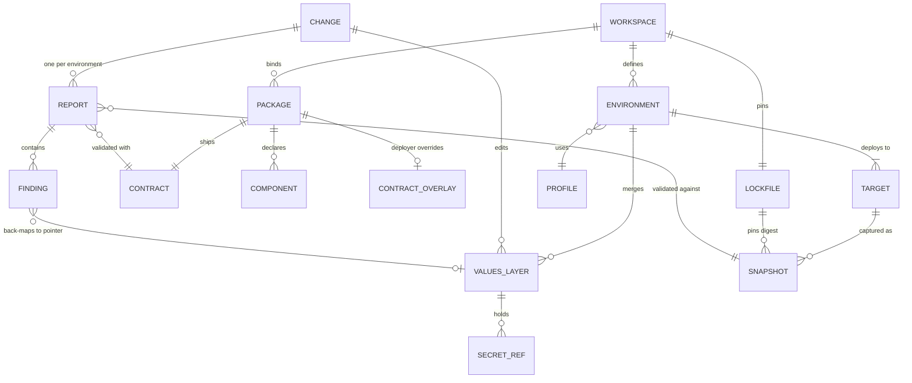
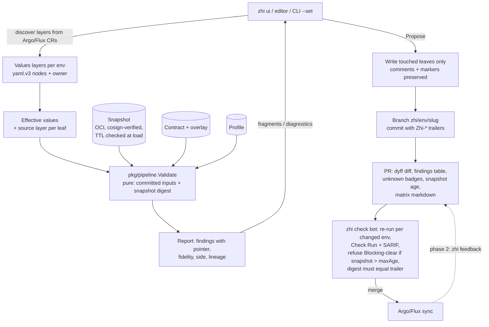

# zhi rewrite — Design v1

*Lead architect synthesis, 2026-09-13. Built on the panel winner (pr-native) with grafts from engine-first, contract-first, fleet-and-evidence and minimalist, and every judge-named fatal flaw fixed. Citations: `report §n` = landscape synthesis; `audit §n` = zhi audit brief; `persona brief` = persona-vendor-to-customer; `embed brief`, `fidelity brief`, `deployer brief`, `competitors brief` = the four gap briefs. Judge lenses are cited as `persona lens`, `feasibility lens`, `ecosystem lens` where they decided a point.*

---

## 0. Decision summary

1. **What we build.** `zhi` is *the PR check that already knows your cluster*: one static Go binary (`CGO_ENABLED=0`) that renders Helm/Kustomize (Compose in phase 2) with the real engines, runs the target cluster's admission chain offline against a signed **snapshot** of that cluster, and opens the PR into the folder Argo CD or Flux already watch. Git is the only write target; zhi never applies (report §1, §8; pr-native thesis).
2. **The wedge ships first.** Months 2–4 produce a CLI-only vertical slice: `zhi snapshot import → zhi validate --exit-code → zhi propose → zhi check` (bot mode on GitHub). This is the ~15k LOC / three-month floor the minimalist proposal named and the ecosystem lens called "the only ordering that puts validation in the push path for every PR author" (competitors brief Task C: Monokle died outside the push path).
3. **The form ships in the MVP and is the last thing cut, not the first.** Build order is CLI → bot → form; cut order under schedule pressure is T2, GitLab, Rego, extra profiles, Compose, LSP/MCP, then the form (engine-first §13 item 10; persona lens advice 3). "First to ship" and "first to cut" are different lists.
4. **Domain model = contract-first's**, addressed by RFC 6901 JSON Pointer everywhere; the finding is the JSON Schema 2020-12 output unit extended with severity, fidelity, lineage and persona side (report §4.8, §9 #11; audit §1.1, lesson 4).
5. **`pkg/pipeline.Validate(ctx, Workspace, Env, Options) → Report` is a pure function** of committed inputs plus a digest-pinned snapshot; pre-commit, CI, UI, LSP and MCP emit byte-identical report digests, and the digest in the commit trailer must match the check run (engine-first §4.1; report §9 #30).
6. **The developer↔deployer contract is three standard-shaped files** shipped with the chart — `values.schema.json` (2020-12 + `x-zhi-*` vocabulary), `values.cel.yaml`, `zhi/requirements.yaml` (Troubleshoot analyzers verbatim + zhi extensions) — **plus a deployer-owned overlay** at `.zhi/contracts/<package>/` in the GitOps repo for charts the deployer does not own (persona lens fatal flaw 3; report §6.2).
7. **Snapshots default to OCI with cosign v3 signing, never cut**; the committed directory `.zhi/snapshots/<env>/` is the air-gap exception; snapshots carry a `developer-safe` slice and a `full` slice because the full slice is customer-confidential (ecosystem lens advice 3; feasibility lens on minimalist).
8. **Fidelity is in the Finding type, not UI copy.** T0-a and T0-b ship by default; T2 live dry-run ships in v1 as an opt-in CLI gate and the test-suite calibration oracle (~300 LOC); T1 (envtest/KWOK) is a phase-3 spike (report §5.2–5.3; minimalist §4.5).
9. **Unknowns policy (provisional):** locally, unobservable inputs are badges; in `zhi check` and CI the default is `--strict`, which promotes them to Warnings; they are never Blocking. Owner to confirm (report §10.2 Q2; ecosystem lens advice 4).
10. **OpenShift ships in the MVP as a data-tier profile** (UID-range placeholder Warning, project-template injection, Route host collisions, IDMS/ITMS, SCC objects as data); SCC *emulation* via `sccmatching` is gated on a spike no proposal ran (persona lens advice 1; feasibility lens on sccmatching).
11. **Both matrices ship in the MVP as text**: package × environment *compatibility* (requirements only) as a CLI table, environment × change *validity* as PR markdown, because `zhi check` already validates every environment whose files changed; the UI matrix is phase 2 (fleet §3; persona lens advice 6).
12. **Plugin depth: shallow — zero loadable plugins in v1, two doors defined.** `Check` and `Resolver` are Go interfaces with one implementation each (the Kyverno CLI adapter; the snapshot inventory). `check/v1` externalises as a `checks:` list of `{name, binary@sha256}` with a JSON contract — no proto, no go-plugin, no marketplace until a second implementor exists (minimalist §8; report §7.3; audit lesson 6).
13. **Not built:** the four gRPC plugin types, transforms, the store layer, the TUI, the marketplace server, Yaegi validators, `text/template`+Sprig as the Kubernetes bridge, an in-cluster component, a database, a hydrated-branch writer in v1, Compose in v1, evidence/FIPS/SBOM-attestation/air-gap mirror before a regulated buyer exists (audit §7.1; report §10.2 Q14).
14. **MVP = "a consultant validates and proposes a Helm values change for one Kubernetes environment, end to end, with a form, an OpenShift data profile and a GitHub check", ≈26–30k non-test Go LOC, eight months for two people, twelve-plus for one**, preceded by a six-week spike sprint (feasibility lens: engine-first's calendar is the honest one).
15. **Measured, not promised.** Fifteen spikes with pass/fail criteria precede architecture freeze; nobody's "<2 s" is measured, Helm emits no template source map, and `sccmatching` has never been built against v0.37.0 without replaces (report §1 last bullet; feasibility lens).

---

## 1. Thesis and personas

### 1.1 Thesis

In the words a DevOps engineer would use: *zhi is `helm template | kubeconform | kyverno apply` grown up into one binary that already knows your cluster, and it opens the PR for you.* The research established that the first real admission check today is post-merge by construction — Argo polls every 120 s + 60 s jitter, Flux per `spec.interval`, CI queues add 30–60 minutes, and Komodor's 2025 data puts median time-to-detect at ~40 minutes (report §3.2). Every evidenced failure class — policy denial, PSA, quota, missing StorageClass or Secret key, removed API, controller RBAC — is visible only in rendered manifests and only against the target cluster's constraints (report §3.1). No product imports those constraints into a portable signed file, runs every engine in one pre-push report with per-finding fidelity, splits authoring and filling across two personas, and writes a PR onto the branch the controller watches (report §8 "what nobody does"). zhi does exactly those things and, on the minimalist's discipline, nothing else in v1.

### 1.2 Developers (author side)

They own the chart, the Compose file and the **contract**: what is configurable, its types, defaults, enums, UI hints, cross-value rules, and what the environment must provide. They never leave their tooling: the contract is `values.schema.json` (Helm 4 validates it natively with the same library zhi uses), `values.cel.yaml` in the helm-cel pattern, and a Troubleshoot-compatible `requirements.yaml` (report §6.1–6.2; persona brief implications 1–2). They run `zhi contract lint` and `zhi contract test` — a conformance table of `values → expected findings` — in the chart repo's CI, and `zhi validate --env dev` against the dev cluster snapshot in their own PRs (contract-first §2; audit §6). They never need cluster access.

### 1.3 Consultants and supporters (deploy side)

They own the GitOps repo and the target environment. Their first-hour path needs **zero developer cooperation**: `zhi snapshot rbac --slice full` emits a minimal, per-layer-annotated ClusterRole for the customer's security team to review; `zhi snapshot import --context eu-prod` runs with that read-only identity and produces a signed OCI artifact; `zhi validate --env eu-prod` runs against the values file that already exists in the repo, with a schema synthesised from `values.yaml` defaults and `# @schema` comments into the deployer-owned overlay at `.zhi/contracts/<package>/` when the chart ships none (persona lens advice 2; report §9 #10). Then `zhi ui` opens a form generated from the contract, with cluster-aware pickers (StorageClass, IngressClass, namespace, existing Secret key, SecretStore) populated from the snapshot — Rancher's live pickers, offline (persona brief implication 5). Every keystroke re-runs the Tier-0 chain; findings are phrased against the field they touched with the policy cited: "restricted-v2 SCC will reject `runAsUser: 1000`", "this PVC will hang: no RWX-capable StorageClass in eu-prod" (pr-native §1; persona lens rationale). Findings with no values pointer are tagged **developer-side** with the resource identity: "not yours to fix, send it back across the border" (pr-native §4.6; persona lens best idea 2).

### 1.4 Who stops paying for what

Report §3.1's failure classes map to the persona that stops paying for each: developers stop shipping charts that assume privileged dev clusters (class 7 PSA, OpenShift SCC/UID) and charts whose contract lies (class 2); deployers stop discovering quota (8), missing references (10), removed APIs (4), policy denials (6), controller RBAC (12) and wrong effective values (16) after merge, and stop waiting 10 minutes to hours for the first real admission check (report §3.2). That mapping goes on the landing page (persona lens best idea 1).

### 1.5 The third role and the transition

Platform teams get a third role for free: they own snapshot refresh (a scheduled job pushing a signed OCI bundle) and distribution profiles without owning anybody's values (contract-first §2; report §5.3 "freshness like a lockfile"). The transition to a DevOps culture changes no artifact: the contract lives with the chart, the environment definition with the GitOps repo, so a developer deploying to their own namespace picks up the deployer surface — same snapshot, same form, same PR (report §6.2; persona brief §5, implication 9). What changes is a CODEOWNERS line: developers own `charts/**` and the contract, deployers own `.zhi/environments/**`, `.zhi/contracts/**` and `envs/<env>/values.yaml`; as ownership moves, lines move (engine-first §2). `x-zhi-persona` is a form-grouping hint that never enforces — role separation stays in Git permissions (contract-first §2). The mentoring loop is `zhi contract test`: developers who start deploying see their own contract fail in CI before a supporter does (persona lens advice 9).

---

## 2. Domain model

### 2.1 Addressing and identity

**JSON Pointer (RFC 6901) everywhere** — values (`/persistence/storageClass`), rendered documents (`/spec/template/spec/containers/0/resources/limits/memory`), findings (`instanceLocation`). `~1` escapes `app.kubernetes.io/name`. The current flat slash path with its `[a-z]` regex cannot express list indices or camelCase keys and is dropped (audit §1.1, lesson 1). Manifests are identified by `file + apiVersion/kind/namespace/name`; Compose services by `file + service`. Every YAML node carries a yaml.v3 source position so findings cite `values-prod.yaml:42:7` (audit lesson 4).

### 2.2 Entities

| Entity | Identity | Lives in | Notes |
|---|---|---|---|
| **Workspace** | Git remote + path of `.zhi/workspace.yaml` | GitOps repo | Environments, package bindings, SCM provider, snapshot registry; most fields *discovered* from Argo/Flux CRs, overridden here (report §9 #2) |
| **Package** | `kind ∈ {helm, kustomize, compose}` + source ref + digest: `oci://…@sha256`, `git+path@sha`, `helmrepo://name@version+digest`, local path | App repo, chart repo or OCI | Git-path and Helm-repo packages are first-class; no forced OCI republish (fixes fleet's OCI-only identity, ecosystem lens) |
| **Contract** | Digest of `{values.schema.json, values.cel.yaml, zhi/requirements.yaml}` | Inside the chart (Helm packages all non-ignored files) | Developer-authored; signed with the chart; components as `x-zhi-component` (contract-first §3) |
| **Contract overlay** | `.zhi/contracts/<package>/{values.schema.json, values.cel.yaml, requirements.yaml}` | GitOps repo | Deployer-owned; merged over the shipped contract (schema `allOf`, rule union, requirement union); the home of synthesised schemas for vendor charts (persona lens fatal flaw 3) |
| **Environment** | `name`, unique per workspace | `.zhi/environments/<name>.yaml` | Promotion order, targets 1:N, namespaces, GitOps binding (tool, CR ref, path, branch, hydrated branch), snapshot ref + `maxAge`, secret-store bindings, profile id, matrix dimensions, `allowDirectPush` (default off), `allowExec` allowlist (report §9 #15) |
| **Target** | K8s: `kube-system` namespace UID + apiserver URL hash; Compose: engine id | Snapshot provenance | Kube-context is a local hint, never committed |
| **Snapshot** | `sha256` of the OCI manifest | OCI registry; `.zhi/snapshots/<env>/` for air-gap; cache `.zhi/cache/snapshots/<digest>/` gitignored | The pseudo cluster; layers per §3.5; `slice ∈ {developer-safe, full}`; `declared.yaml` overlay; TTL (report §5.1, §9 #4) |
| **Profile** | `openshift-4.20@sha256`, `aks-automatic-2026-06@…` | Built in + OCI, pinned in `zhi.lock` | Data + small Go emulators for the opaque half of managed platforms (report §9 #18; deployer brief cross-cutting finding) |
| **Values layer** | `(env, rank, file, pointerPrefix, owner)` | GitOps repo | `chart defaults < common < variant < env < cluster < runtime(substituteFrom) < machine-managed`; `owner ∈ {human, machine:renovate, machine:image-updater, controller}`; machine-owned pointers are read-only (contract-first §3; report §9 #13) |
| **Effective values** | derived | memory | Helm coalesce semantics (`null` deletes), each leaf carrying its source layer (report §3.1 class 16) |
| **Change** | branch + commit SHA(s) | worktree → PR | The working set of edits |
| **Rendered set** | digest of canonical manifests per environment | ephemeral; digest in trailers | Each object carries lineage where recoverable (§3.7) |
| **Finding** | hash of `(engine, ruleId, resourceId, instanceLocation)` | Report | See §2.4 |
| **Report** | digest of canonical JSON | PR check output; OCI referrer of the snapshot; never committed | Findings + provenance; deterministic (report §9 #30) |
| **Component** | name unique per package | Contract (`x-zhi-component`) + env state | Dependency graph, cycle detection, mandatory pre-enable, cascade-disable refusal carried from `internal/core/component.go`, re-addressed to schema pointers and mapped to Helm `condition`, Kustomize `Component`, Compose `profiles` (audit §1.5) |
| **Secret reference** | `ref://<store>/<path>#<key>[@version]` | values files | Never a value; rendered to ESO `ExternalSecret` v1; Blocking if the store is absent from the snapshot's `(Cluster)SecretStore` inventory (report §9 #14) |
| **Lockfile** | `zhi.lock` | GitOps repo | Digests of snapshots per environment, profiles, exec-adapter binaries (Kyverno CLI per snapshot engine version, kwctl), checks — the current `zhi-plugins.lock` shape generalised (audit §2.6) |

### 2.3 Diagram



### 2.4 The finding record

```
Finding {
  id, severity ∈ {Info, Warning, Blocking}, message
  engine, ruleId, policyRef {name, version}          # cite the source policy
  resource {file, apiVersion, kind, namespace, name}  # or {file, service}
  instanceLocation, keywordLocation                   # 2020-12 output unit
  valuesPointer?, layer?, source {file, line, col}?   # back-mapped
  lineage ∈ {targets, fingerprint, sentinel, none}
  fidelity {tier ∈ {t0a, t0b, t2}, exactness ∈ {exact, approximate, predicted}, unobserved []}
  wouldFailAt ∈ {schema, admission, scheduling, runtime}
  side ∈ {deployer, developer, platform}
  proposedValue?
}
```

apiserver `field.ErrorList`, CEL `fieldPath`, Kyverno PolicyReport and Rego paths normalise into it (report §9 #11). Severity mapping is fixed in core: schema/CEL/Deny/Enforce/Preflight-fail → Blocking; VAP Warn, Kyverno Audit, Gatekeeper warn/dryrun, PSA warn/audit, webhook match, stale quota, native-approximate → Warning; deprecation-in, annotations → Info; PolicyExceptions and `enforcementAction` honoured (report §9 #9).

### 2.5 What lives where

Git: workspace, environments, values, contract overlays, lockfile, suppressions. OCI: snapshots, profiles, adapter binaries, reports as referrers. Nowhere persistent: kubeconfigs, store tokens, decrypted secrets, UI session state. Reports are never committed (contract-first §3; minimalist §3).

---

## 3. Architecture

### 3.1 Binary and packages

One module, one binary `cmd/zhi`, `CGO_ENABLED=0`, `k8s.io/* v0.37.0`, `helm.sh/helm/v4 v4.3.0`, `sigs.k8s.io/kustomize/api v0.21.1`, `santhosh-tekuri/jsonschema/v6 v6.0.3`, kubectl-validate by pseudo-version, `homeport/dyff`, `replicatedhq/troubleshoot` (analyzers only), `oras-go/v2`; no `replace` directives; CEL only through `k8s.io/apiserver/pkg/cel/environment` (embed brief §0, §5). `open-policy-agent/opa` and `gatekeeper/v3` are **not** in `go.mod` until Rego is evaluated in phase 2 (ecosystem lens advice 5). `compose-go/v2` enters in phase 2.

```
cmd/zhi                          Cobra; all surfaces
pkg/pipeline                     Validate(ctx, Workspace, Env, Options) → (Report, error) — the only entry point
pkg/report                       public, versioned report/finding types; canonical JSON + digest; JSON/SARIF/PolicyReport/markdown
pkg/check, pkg/resolver          the two doors: Go interfaces, one implementation each (§8)
internal/workspace               .zhi/workspace.yaml, environments, zhi.lock
internal/layout/{argo,flux}      discovery of values layers from controller CRs (compose/ in phase 2)
internal/values                  yaml.v3 nodes, JSON Pointer, layer fold, comment-preserving write-back, lineage
internal/contract                schema ingest + x-zhi vocabulary + CEL compile + overlay merge + synthesis + conformance test
internal/render/{helm,kustomize} Helm v4 SDK (snapshot Capabilities + lookup), krusty (compose/ phase 2; exec adapter phase 2)
internal/snapshot                format, importer, redaction layer, cosign verify chokepoint (exec), OCI push/pull, export adapters, rbac generator
internal/admit                   ordered T0-b chain (§3.3); engines/{schema,discovery,expand,namespace,limitrange,psa,quota,map,vap,webhook,rbac,refs,immutable}
internal/engines                 exec adapters: kyverno (kwctl phase 2); lockfile-pinned; zhi-owned exit codes
internal/profile                 profiles as data + Go emulators (openshift data tier in MVP)
internal/require                 Troubleshoot analyzers on a snapshot-as-bundle adapter + zhi analyzers
internal/matrix                  compatibility and validity matrices (derived, never stored)
internal/finding                 canonical record, severity mapping, back-mapping
internal/scm/github              branch, trailers, PR, check run, SARIF (gitlab/ phase 2)
internal/git                     git binary via the carried apply.go subprocess runner
internal/ui                      htmx shell; form renderer (§3.7); session API
internal/lsp, internal/mcp       phase 2 / phase 3
third_party/k8s/{limitranger,rbac,quotacore}   vendor-forked from kubernetes@v1.37.0 (~2k LOC) + NOTICES
```

### 3.2 Edit → PR data flow



Steps: (1) `internal/layout` reads the controller CRs in the repo and builds the layer stack per environment; runtime layers (`substituteFrom` ConfigMaps, cluster-Secret labels) come keyed-and-redacted from the snapshot's `gitops/` layer (report §2.1). (2) The contract is resolved from the package, the overlay merged, the form generated. (3) Every edit posts to the session; `Validate` runs on candidate values (debounced, cancellable). Because it is pure, the audit's mutate-validate-revert trick is unnecessary — a candidate is just an argument (engine-first §4.6). A Blocking finding on save is refused and the field re-rendered with the finding, preserving the current UI's contract (audit §3.2). (4) Propose writes only touched leaves through the yaml.v3 tree, commits with trailers, opens the PR. (5) `zhi check` re-validates every environment whose files changed; its report digest must equal the trailer's or the check fails with "report mismatch" (engine-first §6; pr-native §4.2 step 5). (6) Post-merge feedback is phase 2 (§5.5).

### 3.3 Render → validate pipeline, in order

The order mirrors the apiserver so mutation precedes validation and Pod-level checks see Pods (report §5.3, §9 #6):

0. **Fold** values layers → effective values with source layer.
1. **Contract stage** (before render, so the deployer gets feedback even when the chart cannot render): JSON Schema over the *merged* values replicating Helm 4's merged-`.Values`-vs-all-subchart-schemas semantics; `values.cel.yaml` rules with `values`, `oldValues` (previous Git revision), `env` bound. Rules referencing `rendered` or `snapshot` are compiled here but run at stage 17 — the contract documents which variables are available in which stage (contract-first §4.3; ecosystem lens fatal flaw 4 on contract-first).
2. **Render** with the real engine: Helm v4 SDK with `Capabilities` and `lookup` fed from the snapshot (Warning when a chart looks up a kind absent from the snapshot); krusty. Exec renderers (Timoni/KCL/Pkl/ytt/`flux build`) speaking KRM `ResourceList` are phase 2 and denied in bot mode unless allowlisted (§5.6).
3. **Discovery**: removed/deprecated GVK on the target minor; scope; replaces pluto/kubent (report §3.1 class 4).
4. **Expand** workloads to Pod templates (gator-expand/Kyverno-autogen style).
5. **Structural schema + defaulting + CRD CEL** via kubectl-validate's `customresource.NewStrategy` path with the server's cost constants; CRDs `exact`, native types `approximate` because KEP-5073 rules are not published (fidelity brief §1, §4; embed brief §0.3).
6. **NamespaceLifecycle**: the namespace exists in the snapshot or is created in this change; on OpenShift the project-request template's quota/LimitRange/NetworkPolicy are injected into the pseudo cluster first (engine-first §4.3 step 7; deployer brief OpenShift).
7. **LimitRanger** (mutate, then validate; vendor-forked) — the defaulting is shown as an Info diff.
8. **PodSecurity** via `pod-security-admission/policy` with namespace labels; cluster defaults/exemptions from `declared.yaml` or the profile, never guessed (fidelity brief §8).
9. **ResourceQuota**: `(used + delta) ≤ hard` per namespace across all documents in the change; `status.used` older than the snapshot TTL → Warning; OpenShift `ClusterResourceQuota` summed across selected namespaces (profile).
10. **Mutation**: MAP via `k8s.io/apiserver/.../policy/mutating`; Kyverno mutate via CLI; profile mutators (AKS safeguards, Autopilot ratios, phase 2); the mutated object is shown as "what the cluster will store".
11. **Validation policies**: VAP via `validating.NewValidator` + `cel.NewCompositedCompiler` as Gatekeeper's `k8scel` driver does, with params, `namespaceObject` and an RBAC-backed `authorizer` from the snapshot; Kyverno CLI `apply` with generated `Context`/`--parameter-resource`/`--userinfo`; Gatekeeper via the cluster's **generated** VAP/VAPB (v3.20+); Rego templates reported "not evaluated" until phase 2 embeds OPA; Kubewarden via `kwctl` phase 2 (report §4.3; fidelity brief §6, §9).
12. **Webhook match prediction**: which `*WebhookConfiguration` rules the request hits, logic unknown → Warning; profile adapters claim known vendor webhooks (cert-manager, kyverno-svc, gatekeeper-webhook-service, GKE Warden) to avoid double counting (report §3.1 class 14).
13. **RBAC**: vendor-forked `RulesAllow` for the controller identity (Argo/Flux SA `SelfSubjectRulesReview` in the snapshot).
14. **References and catalogs**: Secret/ConfigMap names+keys, ServiceAccounts, StorageClass + CSIDriver capability (`rwxCapable ∈ {true, false, unknown}` → unknown is a Warning), IngressClass/GatewayClass, PriorityClass, RuntimeClass, image allow/block lists + IDMS/ITMS, Route/Ingress host collisions (engine-first §5).
15. **Immutable fields**: CRDs via `x-kubernetes-validations` with `oldSelf` (exact); native types via a hand-maintained table (Deployment selector, Service `clusterIP`, PVC `storageClassName`, StatefulSet `volumeClaimTemplates`) labelled `approximate` — not "exact" as pr-native promised (feasibility lens fatal flaw 3).
16. **Requirements**: the contract's analyzers against the snapshot, with chosen values substituted.
17. **Developer CEL rules** over `rendered` and `snapshot`; component dependency rules compiled from `x-zhi-component`.
18. **Profile checks**; then normalise → back-map → severity → tier → report digest.

Exit codes: 0 clean, 1 Blocking, `--warn-exit-code N` for Warnings (default 0), 3 tool error; zhi owns the exit code of every exec adapter, closing the Kyverno v1.12 exit-0-on-FAIL hole (engine-first §4.7; report §3.3).

### 3.4 Fidelity tiers and how they are labelled

| Tier | In v1 | Mechanism | Label on finding |
|---|---|---|---|
| T0-a | default | schema, discovery, structural + CRD CEL | `tier: t0a`, `exactness: exact` (CRD) / `approximate` (native) |
| T0-b | default | stages 6–18 in-process + Kyverno subprocess | `tier: t0b`; `unobserved: ["psa-exemptions", "authorizer-assumed-allow", "webhook:3", "static-policies-1.37+"]` |
| T2 | opt-in CLI (`zhi validate --live`) | `kubectl apply --dry-run=server --validate=strict` with the controller's fieldManager; Argo `server-side-diff`; `flux diff kustomization` | `tier: t2`; shown as a separate delta with the explanation (side-effect webhooks skipped, SSD blind to new resources) (fidelity brief §5) |
| T1 | phase 3, spike-gated | envtest/KWOK hydrated from the snapshot | — |

The report header carries three phrases and nothing stronger: `schema-valid`, `apiserver-valid (CRDs exact, native approximate)`, `policy-valid (N rules skipped needing live data)`; the UI never renders "will apply" (report §5.3, §9 #8). T2 doubles as the calibration oracle in the golden test suite: for every fixture cluster, T0 findings are diffed against live dry-run results and the delta is a tracked metric (minimalist §4.5). `--strict` promotes `unobserved` entries to Warnings and is the default in `zhi check`.

### 3.5 Snapshot format

Own format — kubectl-validate layout for schemas, raw CRDs, 1.37 static-manifest form for VAP/MAP, plain dumps for the rest; export adapters to kubeconform/kubectl-validate/Kyverno-context/gator/flux-schema layouts (report §10.1 verdict; §9 #22). A directory that packs into one OCI artifact: one tar blob per layer (`application/vnd.zhi.snapshot.<layer>.v1+tar`), config blob `manifest.json`, cosign v3 protobuf bundle as an OCI referrer, verified by exec'ing a digest-pinned cosign with `--offline --trusted-root` (audit lesson 7: wire the chokepoint first).

```
manifest.json        schemaVersion, clusterId, serverVersion, capturedAt, capturedBy, importerVersion,
                     slice ∈ {developer-safe, full}, ttl, profileId, redactionPolicyDigest,
                     engines {kyverno, gatekeeper, kubewarden: chart/CLI version},
                     featureState {mapApiVersion: v1|v1beta1, …},
                     layers [{name, digest, resourceVersion, degraded: "resourcequotas: forbidden"}]
discovery/           APIGroupDiscoveryList                                            [developer-safe]
openapi/api/v1.json, openapi/apis/<g>/<v>.json   kubectl-validate layout, ?hash= keyed [developer-safe]
crds/                raw CRDs, x-kubernetes-validations intact                        [developer-safe]
admission/policies/  VAP/VAPB, MAP/MAPB (v1; v1beta1 on 1.34/1.35) + params           [developer-safe]
admission/webhooks/  Validating/MutatingWebhookConfiguration metadata only            [developer-safe]
engines/{kyverno,gatekeeper,kubewarden}/  policies, exceptions, templates, constraints, Config/SyncSet, generated VAP/VAPB  [developer-safe]
namespaces/<ns>/     Namespace labels/annotations, ResourceQuota spec+status, LimitRange, default NetworkPolicies, ClusterResourceQuota  [full]
catalogs/            StorageClass+CSIDriver, IngressClass, GatewayClass, PriorityClass, RuntimeClass, SCC, ComputeClass/NodePool/NodeClass  [developer-safe]
rbac/                Roles/bindings; subjectrules/<identity>.json                     [full]
inventory/           names+keys only: Secrets, ConfigMaps, ServiceAccounts, Services, Ingress/Routes, workloads (oldObject)  [full]
gitops/              Applications/ApplicationSets, HelmReleases/Kustomizations, substituteFrom (keyed, redacted), (Cluster)SecretStores, Sealed Secrets cert, Kargo Stages  [full]
nodes/               optional: allocatable, labels, taints                            [full]
declared.yaml        operator overlay: PSA defaults/exemptions, static .static.k8s.io bundle dir, webhook stubs, Rancher PSACT, profile id
```

Layers per report §5.1; `declared, not observed` for what no API exposes (fidelity brief §2, §8). The **developer-safe slice** lets developers validate against a customer's dev cluster without reading its RBAC, inventory or namespace posture — the snapshot crosses the invisible border and is confidential (ecosystem lens advice 3). Redaction is a tested layer with golden fixtures, not a flag (contract-first §11). The importer is a kubectl-free, read-only Go client over discovery plus a fixed GVR list, degrading per layer and recording why; `zhi snapshot rbac` generates the minimal ClusterRole per slice with a comment per rule naming the layer it feeds, so a bank's security review has a reviewable artifact (report §9 #5; persona lens advice 2). Freshness is a lockfile property: `zhi.lock` pins the digest; `zhi open` refuses at load time, and `zhi check` refuses to clear Blocking, on a snapshot older than the environment's `maxAge` (contract-first §4.2; report §5.3). Kyverno's engine version is recorded and the matching CLI is pinned by digest in `zhi.lock`; more than one CLI version may be pinned when customer clusters lag across the 1.20 ClusterPolicy removal (ecosystem lens advice 7; embed brief §4.1).

### 3.6 UI stack

Shell: Go `html/template` + htmx, embedded, no build step, reusing the carried middleware chain (gzip → ETag → CSRF → CSP nonce → recovery → logging) and its solved interactions (HTML never ETag-cached, gzip outside ETag, `Unwrap()`/`Flush()` for SSE) (audit §3.2, §7.1). Panes: environments/packages/components tree, generated form, form ↔ YAML toggle (Devtron's best idea, competitors brief), rendered manifests with the mutated-object diff (dyff), findings grouped by severity with file:line links and the developer-side/deployer-side split, effective-values explorer per environment, SSE log pane for snapshot import and T2. Loopback, single user in v1.

**Form generation is decided by spike S9, not by preference.** Default: a Go-native renderer walking the compiled schema — object → fieldset, `enum` → select, boolean → toggle, number → bounded input, string `format` → typed input, `x-zhi-widget` overrides, `x-zhi-cluster-ref` → select fed from the snapshot, `x-zhi-secret` → masked reference input, arrays of objects → repeatable fieldsets, `x-zhi-group`/`x-zhi-order`/`x-zhi-persona` → grouping, `x-zhi-advanced` hidden by default (contract-first §4.6; minimalist §4.6). Conditional visibility (`x-zhi-show-if`, component toggles) is evaluated **server-side in CEL** and returned as a visibility map so the browser never runs a second expression language — Rancher's Ember-vs-Jexl divergence cannot recur (engine-first §4.6; persona brief pain points). Anything the renderer cannot express (deep `oneOf`, free-form `additionalProperties`) falls back to an embedded YAML editor bound to that subtree. The session API returns findings in the RJSF `extraErrors`/ErrorSchema shape from day one, so the exit is designed in (contract-first §4.6). **Go/no-go criterion for S9:** on Bitnami redis and two of the company's own charts, ≥95 % of leaf fields render as typed widgets and no top-level group a deployer must touch degrades to the YAML fallback. If it fails, the form becomes a single RJSF v6 island with Ajv2020 configured, built once in CI, committed as `dist/` with a freshness check, locked, SBOM'd and scanned — and the visibility map, session API and pipeline do not change (engine-first §4.6; persona lens advice 5; ecosystem lens advice 5). The persona lens is right that a form which degrades on the charts consultants deploy is worse than none; the feasibility and ecosystem lenses are right that Node is a tax worth a spike to avoid.

### 3.7 Lineage (values pointer ↔ rendered pointer)

Helm's renderer emits no source map from rendered fields to template lines — only error positions — so pr-native's S9 premise is false (feasibility lens fatal flaw 2). Day-one lineage is therefore: (a) schema and `values`-stage findings already carry a values pointer; (b) developer-declared `x-zhi-targets` (schema field → rendered pointer, the Glasskube `targets` idea) (fleet §4.6; persona brief §1); (c) a scalar-fingerprint match of the flagged rendered value against unique effective-value leaves; (d) otherwise the finding anchors on the rendered document with its resource identity and is tagged `developer-side`; Kustomize origin annotations give file:line where present. Spike S10 measures coverage of (b)+(c) on real charts and tries contract-first's sentinel-substitution rendering as the phase-2 upgrade (contract-first §11 S-SOURCEMAP).

### 3.8 CLI, CI, LSP, MCP

- **CLI:** `zhi snapshot {rbac,import,refresh,verify,export,diff}`, `zhi env {import,list}`, `zhi contract {init,lint,emit,test}`, `zhi validate --env <e> [--strict] [--live] [--format json|sarif|policyreport|md] [--exit-code]`, `zhi matrix [--compat|--change]`, `zhi render`, `zhi diff`, `zhi propose`, `zhi check`, `zhi ui`, `zhi explain <finding-id>`.
- **CI:** the same binary; a GitHub Action wrapping `zhi check`; pre-commit hook; snapshot refresh as a scheduled job pushing a signed OCI bundle (report §9 #19).
- **Editor for free in v1:** `zhi contract emit` writes `.zhi/schema.json` and injects the `# yaml-language-server: $schema=` modeline into managed values files (report §9 #28).
- **LSP (phase 2):** diagnostics from the same pipeline with yaml.v3 ranges, hover with effective value + source layer, code actions applying `proposedValue`.
- **MCP (phase 3):** stdio + streamable HTTP, loopback, read-only default, generated from the same command descriptors as the CLI once `pkg/report` stabilises — audit lesson 9: the fourth re-marshalling of an unstable surface is the expensive one (report §9 #29).

---

## 4. Developer ↔ deployer contract

Two developer-authored artifacts kept separate as KOTS keeps `Config` and `Preflight` separate, never merged into templates; both survive without zhi at runtime (report §6.2; persona brief implications 1, 11).

**Consumed:** `values.schema.json` (drafts 4–2020-12; 2020-12 when `$schema` is absent, matching Helm 4.3 and `jsonschema/v6`), `# @schema`/`## @param`/helm-docs comments, ytt schema, Timoni `#Config` (via CUE import, phase 3), kro SimpleSchema, XRD/CRD `openAPIV3Schema`, Rancher `questions.yaml` and OLM `x-descriptors` hints on import, Compose `${VAR:?}` (phase 2) (report §6.1). **Emitted:** `values.schema.json` with `x-zhi-*` in place, `Chart.yaml kubeVersion`, `templates/zhi-preflight.yaml` (`troubleshoot.sh/kind: preflight` Secret with the Troubleshoot-native subset), `.zhi/schema.json` + modeline.

**(a) `values.schema.json`** — the `x-zhi` vocabulary is declared with `$vocabulary` and registered as a custom vocabulary in `jsonschema/v6` so hints are type-checked by zhi and treated as annotations by every other validator by spec, not by luck (pr-native §5a; embed brief §4.3):

```json
{
  "$schema": "https://json-schema.org/draft/2020-12/schema",
  "$vocabulary": { "https://zhi.dev/vocab/ui/v1": false },
  "type": "object",
  "properties": {
    "replicaCount": { "type": "integer", "minimum": 1, "maximum": 20, "default": 1,
                      "x-zhi-group": "Scaling", "x-zhi-order": 10 },
    "persistence": { "type": "object", "x-zhi-group": "Storage", "properties": {
      "accessMode":   { "enum": ["ReadWriteOnce", "ReadWriteMany"], "default": "ReadWriteOnce" },
      "storageClass": { "type": "string", "x-zhi-cluster-ref": "storageclass",
                        "x-zhi-persona": "deployer",
                        "x-zhi-targets": ["/spec/volumeClaimTemplates/0/spec/storageClassName"],
                        "x-zhi-help": "Leave empty for the cluster default." } } },
    "db": { "type": "object", "properties": {
      "passwordRef": { "type": "string", "format": "zhi-secret-ref", "x-zhi-secret": true,
                       "x-zhi-cluster-ref": "secret-key" } } },
    "ingress": { "type": "object", "x-zhi-component": "ingress", "properties": {
      "className": { "type": "string", "x-zhi-cluster-ref": "ingressclass" } } },
    "image": { "properties": { "tag": { "type": "string", "x-zhi-machine-managed": "renovate" } } }
  }
}
```

Vocabulary: `x-zhi-widget`, `x-zhi-group`, `x-zhi-order`, `x-zhi-help`, `x-zhi-secret`, `x-zhi-component`, `x-zhi-persona` (grouping only), `x-zhi-advanced`, `x-zhi-show-if` (CEL, evaluated server-side), `x-zhi-immutable`, `x-zhi-machine-managed`, `x-zhi-targets`, `x-zhi-severity`, and the **cluster-aware field types** `x-zhi-cluster-ref ∈ {storageclass, ingressclass, gatewayclass, namespace, secret-key, configmap-key, serviceaccount, priorityclass, runtimeclass, secretstore, image}` — Rancher's `storageclass`/`secret` pickers and OLM's `io.kubernetes:Secret` mapped on import and fed from the snapshot's `catalogs/` and `inventory/` layers (persona brief implication 5; report §6.1).

**(b) `values.cel.yaml`** — helm-cel pattern, VAP variable conventions, compiled in the k8s CEL environment pinned to the snapshot's minor so rules can later be promoted to a cluster VAP unchanged (report §9 #12). Variables by stage: `values`, `oldValues`, `env` at stage 1; `rendered`, `snapshot` at stage 17:

```yaml
apiVersion: zhi.dev/v1
kind: ValuesRules
rules:
  - name: rwx-needs-capable-class
    severity: Blocking
    stage: values            # default; 'rendered' rules run after admission
    expression: >-
      values.persistence.accessMode != 'ReadWriteMany' ||
      env.storageClasses.exists(sc, sc.name == values.persistence.storageClass && sc.rwxCapable == true)
    messageExpression: "'StorageClass ' + values.persistence.storageClass + ' cannot provide RWX in this environment'"
    fieldPath: /persistence/storageClass
    wouldFailAt: runtime
  - name: replicas-not-reduced-in-prod
    severity: Warning
    expression: "env.name != 'prod' || values.replicaCount >= oldValues.replicaCount"
```

`sc.rwxCapable` is derived from CSIDriver where the driver publishes it and is `unknown` (Warning) otherwise (engine-first §5).

**(c) `zhi/requirements.yaml`** — Troubleshoot analyzers verbatim (so the emitted Preflight Secret needs no translation), plus a `zhi:` block for what Troubleshoot lacks, plus the profile support declaration; analyzers may reference the deployer's chosen values (persona brief implication 4; fleet §5):

```yaml
apiVersion: zhi.dev/v1
kind: Requirements
kubeVersion: ">= 1.30.0-0"                       # also written to Chart.yaml
requiredAPIs: [cert-manager.io/v1/Certificate, external-secrets.io/v1/ExternalSecret]
profiles: { supported: [vanilla, openshift-4.18+], unsupported: [gke-autopilot] }
analyzers:                                       # troubleshoot.sh/v1beta2, emitted as-is
  - clusterVersion: { strict: true, outcomes: [{ fail: { when: "< 1.30.0", message: "Requires 1.30+" } }, { pass: { message: ok } }] }
  - storageClass: { storageClassName: "{{ .Values.persistence.storageClass }}",
                    outcomes: [{ fail: { message: "StorageClass missing" } }, { pass: { message: ok } }] }
zhi:                                             # evaluated only by zhi; omitted from the Secret
  - storageClassCapability: { name: "{{ .Values.persistence.storageClass }}", accessMode: "{{ .Values.persistence.accessMode }}", severity: Blocking }
  - quotaHeadroom: { namespace: "{{ .Release.Namespace }}", warnAbove: "80%" }
  - podSecurityLevel: { namespace: "{{ .Release.Namespace }}", maxEnforce: baseline }
  - crdVersion: { name: certificates.cert-manager.io, servedVersion: v1 }
```

`profiles.unsupported` turns the compatibility matrix red before anyone imports a snapshot (fleet §5; persona lens best idea 4). Embedding Troubleshoot's analyzers means budgeting the support-bundle-layout adapter (`cluster-resources/*.json` from snapshot layers) — a named spike, not an assumption (feasibility lens on contract-first).

**Deployer overlay.** `.zhi/contracts/<package>/` holds the same three files, deployer-owned, merged over the shipped contract: schema via `allOf`, rules and requirements by union, `x-zhi-*` hints overriding. This is where `zhi contract init` writes a synthesised schema for a Bitnami or vendor chart the consultant cannot push to, and where the consultant adds the rule the developer forgot. Findings from overlay rules are tagged `side: deployer`.

**`zhi contract test`** — a conformance table in the chart repo's CI (contract-first §2; audit §6):

```yaml
cases:
  - name: rwx-on-rwo-class
    values: { persistence: { accessMode: ReadWriteMany, storageClass: standard } }
    snapshot: fixtures/eks-standard
    expect: [{ rule: rwx-needs-capable-class, severity: Blocking }]
```

**Severity model.** The current triad maps 1:1 onto Troubleshoot fail/warn/pass + `strict`, VAP Deny/Warn/Audit, Kyverno Enforce/Audit, Gatekeeper deny/warn/dryrun (report §6.1 severity row; persona brief implication 6); the mapping in §2.4 is fixed in core and not pluggable.

---

## 5. GitOps integration

### 5.1 Discovery

`internal/layout` never asks where values live; it reads what the controllers read (report §9 #2; pr-native §6). Argo: `Application.spec.source(s).helm.{valueFiles,valuesObject,parameters,fileParameters}` with precedence `parameters > valuesObject > values > valueFiles > chart`, `kustomize.{images,replicas,patches}`, ApplicationSet git-files generators (per-env `config.json/yaml` flattened into template params), cluster-generator labels (from the snapshot's cluster Secrets), `sourceHydrator.{drySource,syncSource,hydrateTo}`. Flux: `HelmRelease.spec.{values,valuesFrom[ConfigMap|Secret, valuesKey, targetPath, optional],chart.spec.valuesFiles}` (valuesFrom in list order, then inline), `Kustomization.spec.postBuild.substitute(From)` with `${VAR:=default}` strictness (missing variable without default = Blocking, matching kustomize-controller 1.9), `spec.patches`, `spec.images`. Kargo `Stage`s give promotion order and which files `yaml-update`/`kustomize-set-image` touch (machine-managed, read-only). Compose (phase 2): `-f` chains, `compose.override.yaml`, `COMPOSE_FILE`, `.env`, `env_file`, `profiles`, `include`. Layouts: folder-per-env on trunk, app-of-apps/ApplicationSet-generated, rendered-manifest branches; branch-per-env is read-only legacy with a warning (report §2.1). Environments are inferred on `zhi env import` and written to `.zhi/environments/*.yaml` for confirmation.

### 5.2 PR production

Branch `zhi/<env>/<slug>`; one commit per proposal touching only human-owned layers; edits through yaml.v3 nodes so comments, ordering, anchors and Image-Updater/Renovate markers survive (report §9 #13). Trailers:

```
Zhi-Package: oci://ghcr.io/acme/app@sha256:…    Zhi-Contract: sha256:…
Zhi-Snapshot: eu-prod@sha256:… (captured 2026-09-12T10:00Z)
Zhi-Profile: openshift-4.20@sha256:…            Zhi-Rendered: sha256:…
Zhi-Report: sha256:…    Zhi-Tier: t0b    Zhi-Dry-Sha: <dry commit when hydrated>
```

— the `hydrator.metadata`/`Argocd-reference-commit-*` shape Argo already uses (report §9 #1). PR body, argocd-diff-preview-shaped: per environment a collapsible dyff diff, the findings table with severity, fidelity, side, policy source and file:line links, badges for unobserved inputs, the snapshot id and age, and the environment × change matrix as markdown. `zhi check` posts a GitHub Check Run + SARIF; branch protection can require it. DRY-repo PRs are the primary write target because they work for Flux, Compose and Kargo OSS alike (report §10.1); `allowDirectPush: true` per environment, default off, is the only way zhi ever writes to a controller-synced branch (report §10.2 Q13; pr-native §6).

### 5.3 Hydrated branches and promotion hooks (phase 2)

For Argo Source Hydrator estates zhi validates the `hydrateTo` branch as a PR check, reading the dry SHA from `refs/notes/source-hydrator`, not commit messages (report §4.1). For gitops-promoter zhi is a `CommitStatus` provider; for Kargo OSS zhi's PR is what `git-wait-for-pr`/`git-merge-pr` wait on and `zhi check` can be called from the built-in `http` step; the container-step integration is Enterprise-only and therefore an Akuity-customer add-on (report §9 #25; competitors brief "Kargo — settled"). zhi never orchestrates preview environments; it links Flux ResourceSet/Argo PR-generator previews back into the PR.

### 5.4 The bot is the product for CI-first shops

`zhi check` runs on the PR head against every environment whose files changed, refuses to clear Blocking when any snapshot exceeds `maxAge`, runs `--strict` by default, and fails on a report-digest mismatch with the trailer. Renovate, Kargo and human PRs are validated uniformly (pr-native §4.2 step 5; minimalist §6).

### 5.5 Post-merge feedback (phase 2)

`zhi feedback` subscribes to Argo application status (REST watch or Notifications webhook target) and Flux conditions (notification-controller commit-status providers), correlates hydrated SHA ↔ dry SHA ↔ PR ↔ author, and comments on the merged PR: "synced/healthy at 14:02", or the controller's rejection next to the finding zhi did or did not raise. A rejection matching an `unobserved` badge is a "would-have-caught" miss; one matching a suppressed Blocking is an override. Both feed the outcome metric — Blocking findings caught pre-push per PR and would-have-failed-at stage — computed locally with zero egress, and the predicted-vs-observed record is the calibration signal for profiles (report §9 #24, #31; fleet §6). Credentials: a read-only Argo RBAC token (`applications, get`) or Flux receiver secret, held in the CI secret store, never in the workspace, separate from any cluster credential (ecosystem lens fatal flaw 3). Optionally zhi fires Argo `/api/webhook` or a Flux `Receiver` to skip the poll (report §3.2).

### 5.6 Bot-mode security

`zhi check` evaluates PR-controlled inputs. CEL is cost-budgeted and Helm templating is bounded; a repo-selected exec renderer is arbitrary code on the runner (ecosystem lens fatal flaw 2). Rules: every exec binary — Kyverno CLI, kwctl, cosign, git, future renderers and checks — is digest-pinned in `zhi.lock`; adapters run with no network and a scratch `HOME`; exec renderers and external checks are denied in `zhi check` unless listed in the environment's `allowExec` allowlist, which lives in `.zhi/environments/<env>.yaml` owned by the deployer side per CODEOWNERS, not by the PR author. No PATH auto-detection of anything.

---

## 6. Docker Compose path (phase 2)

Same model, second renderer, host snapshot instead of cluster snapshot; the domain model is target-agnostic from day one so Compose lands without a migration (report §1, §9 #17; all three judges: phase 2). Package kind `compose`; renderer compose-go v2 — loaded first with interpolation off to run `template.ExtractVariables` (the editable value set with defaults and `:?` required flags, what `docker compose config --variables` prints), then with the UI's mapping to obtain the resolved `types.Project`; the 2020-12 Compose schema and ~28 consistency checks become Blocking findings with pointers. The contract is the same `values.schema.json` over the variable set (synthesised from `${VAR:-default}`/`${VAR:?}`), the same CEL rules over the normalised project JSON, and requirements over the host snapshot. zhi adds **strict interpolation** — referenced-but-unset → Blocking, defaulted → Warning, empty `image`/`ports`/`volumes` → Blocking — the class `config -q` cannot see (report §3.1 class 17).

**Host snapshot** (`zhi snapshot import --docker-context …`, or via the Portainer API/Komodo Periphery — never Komodo's GPL code): Engine/API and Compose versions, OS/arch, cgroup version, rootless/userns, seccomp/AppArmor defaults, address pools, CPU/memory/GPU, listening host ports, existing networks/volumes/containers/projects, images with digests, registry reachability, bind-source existence, swarm/podman flags (report §5.1 Compose analogue). **Host-aware checks:** port collisions against the snapshot and across projects, missing bind sources, cross-project `container_name` collisions, limits vs capacity, `gpus` without GPU, `deploy.*` with `swarm: false` (Warning), flavour-unsupported attributes, version gates, image tag existence via registry HEAD when online; the default policy pack mirrors Portainer BE's security dimensions as CEL data. Write-back never rewrites `compose.yaml`: values land in `.env` and `compose.<env>.yaml` so plain `docker compose up`, Portainer Git stacks, Komodo ResourceSync and CI-over-SSH keep working. Secrets resolve at export via `sops exec-env`, the one model identical for Compose and Kubernetes (report §4.7). Podman/Quadlet is a flavour flag on the Kubernetes path, phase 3; Ansible and Nomad are out of scope (deployer brief Part 3).

---

## 7. Distribution profiles and regulated features

**Profiles are data plus small Go emulators, versioned with changelogs, pinned in `zhi.lock`**, because the opaque half of every managed platform can only be encoded from vendor docs and an auditor must see which rule set produced a report (deployer brief cross-cutting finding; report §9 #18). Each profile has an owner and a budgeted recurring day per quarter (fleet §10).

**v1 (MVP):** `vanilla` and `openshift-4.x` **data tier**: SCCs and namespace `openshift.io/sa.scc.*` annotations as snapshot data; for namespaces the PR creates, a synthesised UID-range placeholder with the Warning "image must not assume a fixed UID; `runAsUser: 1000` will be rejected by restricted-v2" — the #1 vendor-chart failure, which needs no `sccmatching`; project-request template injection before quota/LimitRange/NetworkPolicy evaluation; Route host collisions across the snapshot; Ingress annotations only nginx understands; IDMS/ITMS rewrite and allowed/blocked registries; `ClusterResourceQuota` summation; PSA/SCC label sync (deployer brief OpenShift table). **SCC emulation** (`sccmatching.ConstraintAppliesTo` through a snapshot-backed authorizer, priority → restrictiveness → name ordering) is gated on spike S11 and calibrated against `oc adm policy scc-subject-review`; if the spike fails, the data tier stays and SCC selection is reported as `unobserved`. This reconciles the persona lens ("ship OpenShift or do not ship to this company's consultants") with the feasibility lens ("sccmatching is unaudited").

**Phase 2:** GKE Autopilot (Warden constraint set as data, resource-ratio mutation shown as an Info diff so Git values already match and Argo does not drift-alert), AKS (Deployment Safeguards mutators and validators, `k8sazure*` templates via generated VAP or Rego per spike S12), EKS Auto Mode (NodePool/NodeClass fit, Pod Identity association check), Rancher (PSACT from the management cluster, project quotas, rancher-webhook namespace rules) (deployer brief Part 1).

**Regulated features are phase 3 unless a named buyer exists** (report §10.2 Q14; audit lesson 10; ecosystem lens on fleet). What v1 does ship because it is cheap release-pipeline configuration or a correctness property: cosign v3 offline verification of snapshots with pinned `--trusted-root`; zero egress by default with a documented allow-list; `govulncheck` and a CycloneDX SBOM for zhi itself in CI from commit one; deterministic reports (identical inputs → identical digest); developer-signed contract vs deployer-filled values as separately signed halves once signing exists (deployer brief Part 2 checklist). Phase 3 adds DSSE + SLSA VSA v1 statements bound to rendered + snapshot + profile + package digests as OCI referrers ("a few hundred lines on top of an already-canonical report", fleet §13), `GOFIPS140` build variant, SPDX 3.0.1, the air-gap export/import reusing the current `zhi-mirror` bundle format and the on-site flow (import at the customer with read-only RBAC, sign, carry out as a tarball, validate at the desk) (fleet §2/§4; audit §2.6).

---

## 8. Plugin system: how deep

**Answer: shallow, mostly data, zero loadable plugins in v1, two doors defined at zero cost.** Every one of the 17 briefs converged on "shallow": thriving tools extend via data, CEL, digest-pinned CLI binaries or slowly Wasm; sidecar/gRPC plugins inside the deploy path are universally painful (Argo CMP #15006, Kustomize plugins alpha for five years) (report §1, §7.1–7.3). The audit measured the current boundary at ~11,000 LOC of plumbing that could not host the one plugin users wanted to swap and had zero third-party implementors (audit §2, lesson 6). Minimalist's doctrine — earn a boundary with a second implementor — is the yardstick, and its walk of report §3.1 shows every class maps to a snapshot layer plus a fixed engine or a CEL rule, while class 14 (opaque webhooks) is unpluggable by nature (minimalist §8).

| Concern | Mechanism | Why |
|---|---|---|
| Source loaders (YAML/JSON/TOML/env, Helm values, Kustomize, Compose) | **Fixed core** | Need yaml.v3 positions and comment-preserving writes; Renovate regrets losing positions (report §7.2) |
| Layout discovery (Argo, Flux, Kargo, Compose) | **Fixed core** + declarative file-pattern maps | Few, stable CR shapes |
| Renderers | **Fixed**: Helm v4 SDK, krusty, compose-go; **exec adapter** speaking KRM `ResourceList` for Timoni/KCL/Pkl/ytt/`flux build` (phase 2, allowlisted) | "Valid in zhi" = "valid for the controller"; CGO/JVM/Node excluded from core (report §4.2, §9 #3) |
| Values contract and UI hints | **Data**: JSON Schema 2020-12 + `x-zhi-*` | Helm 4 enforces it for free (report §6.1) |
| Cross-value and environment rules | **CEL** via the k8s environment, fixed host library | The language the cluster speaks; no bespoke `when` DSL (report §9 #12) |
| Cluster policies | **Data** imported untranslated, evaluated by embedded k8s.io packages | Kubernetes 1.37 made "policies as files" official (report §4.3) |
| Third-party engines (Kyverno, kwctl, gator, flux-schema) | **Exec adapters**, digest-pinned in `zhi.lock`, zhi-owned exit codes | Kyverno's fork replace and CVE cadence (embed brief §0.4) |
| Environment requirements | **Data**: Troubleshoot analyzers + zhi block | Survives without zhi (persona brief) |
| Distribution profiles | **Data + small Go emulators**, versioned OCI | Encoded from vendor docs with changelogs (deployer brief) |
| Snapshot importers (K8s, Docker, Portainer, Komodo, Rancher/OpenShift/cloud APIs) | **Fixed core** | Importer correctness is the product (report §9 #5) |
| Secret resolvers, credentialed cloud collectors | **`Resolver` door** — Go interface; snapshot inventory now, Vault via MPL API client compiled in (phase 2); go-plugin gRPC `resolver/v1` only when an external implementor appears | The one place every brief wants a process boundary; Vault chose isolation (report §7.3 #1) |
| Checks CEL cannot express | **`Check` door** — Go interface; Kyverno adapter is the first implementation; externalised as `checks: [{name, binary, sha256}]` with a JSON contract; Wasm via wazero behind the same interface if demand appears | Kubewarden proves the shape; Helm 4's slow Wasm uptake and Extism's 18-month gap say do not depend on it (report §7.3 #2; embed brief) |
| SCM targets, report formats, PR bodies | **Fixed core** + templates | Interop formats, not extension points |
| UI panels, forms, LSP, MCP | **Fixed surfaces** | Backstage/Grafana/VS Code show pluggable UI maximises breakage (report §7.1) |

**The two doors' contracts.** `check/v1`: stdin JSON `{apiVersion: zhi.dev/check/v1, rendered: ResourceList, snapshotDir, values, env}`, stdout JSON findings in the `pkg/report` schema; binary from signed OCI by digest, recorded in `zhi.lock`, declared in `.zhi/workspace.yaml` `checks:`, run with no network and scratch `HOME`, denied in bot mode unless allowlisted (§5.6). Versioning is additive on the JSON contract; `pkg/report` is semver'd. `resolver/v1`: `Resolve(ref) → {exists, keys, versions}`; if it ever crosses a process boundary it uses `zhi.plugin.v1` with capability flags and tolerant enums, Terraform/LSP-style (report §7.3). **Distribution:** the carried OCI client, media types and digest lockfile, plus a curated krew-index-style catalog file; no marketplace, ratings, advisories or mirror server until third-party plugins exist (report §9 #20; audit §2.7).

**Not pluggable, by decision:** the finding record, the admission order, severity semantics, the snapshot format and importer, the renderer engines for the three package types, the CEL host library, the store (Git), any hook that mutates values or manifests between edit and commit (the current `transform` type — what Flux forbids and Argo suffers, report §7.3), the UI.

**Migration from today's four gRPC types.** `config` (4 methods) → fixed loaders plus the data contract; `transform` (3 methods, `ValidatePolicy` tri-state) → dropped; `store` (27 methods) → Git plus `ref://` secret references and the `Resolver` door; `ui` (25 methods × 8 implementations) → `pkg/pipeline` consumed by surfaces. Net: from four gRPC types, 967 lines of IDL and 10,790 generated lines to zero required boundaries in v1 and at most two optional ones later (audit §2.1–2.2, §2.7). What survives from the plugin subsystem is its distribution hygiene — signed OCI, lockfile, `launch/audit.go` binary integrity — applied to adapters, profiles and snapshots.

---

## 9. Carry-forward from current zhi

| Current concept | Verdict | Where it lands |
|---|---|---|
| Info/Warning/Blocking triad | Keep | `Finding.severity`; maps 1:1 onto every engine's levels (audit §1.6) |
| Cross-value validation with whole-tree read | Keep concept | One pass over the rendered set; never per-path over a wire (audit §1.3 O(N²)) |
| `TreeReader` read-only seam | Keep | The typed read-only `values`/`snapshot` views handed to CEL |
| `ComponentManager` graph, Kahn cycles, mandatory pre-enable, cascade refusal | Keep near-verbatim | Re-addressed to schema pointers; mapped to native switches (audit §1.5) |
| `apply.go` subprocess handling (process groups, `WaitDelay`, pipe drain, 1 MiB scanner, exit-as-result) | Keep line for line | `internal/git`, `internal/engines`, cosign, T2 (audit §4.3) |
| Pre-check gating | Keep | The T2 hook |
| Drift/diff | Keep, promote | Desired vs previous revision vs hydrated vs live; dyff replaces the LCS diff (audit §4.4) |
| Mutate-validate-revert inline UX | Keep semantics | Pure `Validate` on candidate values; Blocking refused on save (audit §3.2) |
| Severity-grouped findings page | Keep | Now with file:line and side |
| htmx server + middleware chain + SSE pane | Keep | `internal/ui` (audit §3.2, §7.1) |
| `labels` registry / widget selection | Adapt | `x-zhi-*` vocabulary (audit §2.7) |
| OCI client, media types, multi-platform index, atomic install | Keep | Snapshots, profiles, adapter binaries (audit §2.6) |
| Digest-pinning lockfile | Keep | `zhi.lock` |
| `launch/audit.go` integrity hygiene | Keep | Downloaded binaries and bundles (audit §2.4) |
| Air-gap OCI layout + bundle format | Defer | Phase 3, regulated buyer |
| Vault client (MPL) + `store.writeonly` | Adapt | `ref://` references; `Resolver` phase 2 (audit §5.1) |
| OIDC login + callback server | Adapt | Cluster/secret-manager login on import |
| Test/CI conventions (`-race -count=1`, fmt-diff, codegen freshness, `testdata/`, `startTestServer`) | Keep | Plus golden fixtures, T2 calibration oracle, policy conformance table (audit §6) |
| Flat slash paths, `[a-z]` regex, `Val any` + 330 LOC coercion, `Metadata["path"]`, `Value.Validators` | Drop | JSON Pointer + schema-derived types (audit §1.1–1.3) |
| Yaegi-interpreted Go validators | Drop, urgently | CEL only; PRs arrive from forks (audit §1.4, lesson 3) |
| Four gRPC types, generated stubs, JSON-over-protobuf, `transform`, `store`, `ui.Controller × 3`, TUI, `RequiresTTY` | Drop | §8 (audit §2, §3.3) |
| Marketplace server, ratings, advisories, unwired Sigstore stack | Drop | Exec cosign at one chokepoint; catalog file (audit §2.6, lesson 7) |
| `text/template` + Sprig bridge, `fileACL`/`fileMode` | Drop | Real engines; typed model (audit §4.1–4.2) |
| Meta-plugin SDK | Drop | Solves a problem the rewrite lacks (audit §2.4) |

---

## 10. Roadmap

### 10.1 Spike sprint (weeks 0–6, before architecture freeze)

Fleet's format: each spike has a pass/fail criterion and an oracle (fleet §11).

| # | Spike | Pass criterion |
|---|---|---|
| S1 | kubectl-validate `pkg/validator` (pseudo-version) on a CRD with a failing `x-kubernetes-validations` rule, ratcheting with `oldObject`, budget exhaustion | Server-identical error text vs kind cluster |
| S2 | VAP/MAP offline: `validating.NewValidator` + `cel.NewCompositedCompiler` + `mutating` with snapshot params, `namespaceObject`, RBAC authorizer | Identical verdicts vs `kubectl --dry-run=server` on kind with the same policies; per-object latency recorded |
| S3 | `kyverno apply --context-file --parameter-resource --userinfo --policy-report` from generated side files incl. a MAP paramRef; `--crd-paths` | Reproduces a known in-cluster denial; zhi-owned exit codes |
| S4 | Vendor-fork LimitRanger, `RulesAllow`, `evaluator/core` from kubernetes@v1.37.0 against staging modules only | Builds with no replaces; `pkg/apis/core` conversion bounded (embed brief §5 UNVERIFIED) |
| S5 | Helm 4.3 SDK render with snapshot Capabilities and snapshot-backed `lookup`; 2020-12 `values.schema.json` with `$vocabulary` + `x-zhi-*` end to end; subchart schema merge | Annotations ignored by `helm template`; merged-`.Values` semantics reproduced |
| S6 | yaml.v3 round-trip over the company's real values files (anchors, markers, `null` deletes) | Byte-identical untouched regions |
| S7 | Full-chain T0 latency: 40-object app, 300-CRD snapshot, 50 Kyverno policies, warm | < 2 s or the per-keystroke claim is dropped from copy |
| S8 | Import size/time/RBAC degrade on EKS, AKS and OpenShift with minimal RBAC; MAP v1/v1beta1 fallback | Per-layer graceful degradation recorded in `manifest.json` |
| S9 | Go-native schema→form on Bitnami redis + two internal charts | ≥95 % leaves typed, no top-level deployer group in YAML fallback; else RJSF island |
| S10 | Lineage: `x-zhi-targets` + scalar fingerprint coverage on three real charts; sentinel-substitution cost | Coverage % reported; sentinel go/no-go for phase 2 |
| S11 | `openshift/apiserver-library-go` `sccmatching` builds against k8s.io v0.37.0 with no replaces; offline `ConstraintAppliesTo` vs `oc adm policy scc-subject-review` on OpenShift 4.18+ | Identical SCC selection on 20 fixture pods; else data tier only |
| S12 | AKS Azure Policy cluster: are `k8sazure*` templates CEL (generated VAP) or Rego? | Decides whether OPA embedding is phase 2 or phase 3 |
| S13 | Troubleshoot analyzers on a snapshot-as-bundle adapter | `storageClass`, `clusterVersion`, `customResourceDefinition`, `nodeResources` pass on a synthetic bundle |
| S14 | Practitioner survey at the owner's company: failure-class frequency, distributions deployed this year | Orders the check backlog and confirms OpenShift-first (report §10.2 Q7, Q17) |
| S15 | (phase-3 gate) envtest/KWOK boot with restored snapshot and `--admission-control-config-file`; Gatekeeper `k8scel` `request.userInfo` offline | Boot time measured; userInfo reachable or not |

### 10.2 MVP (months 2–8; ≈26–30k non-test Go LOC; eight months for two people, twelve-plus for one)

*Milestone M1, months 2–4, CLI-only vertical slice (≈15k LOC — the minimalist floor):* `zhi snapshot rbac|import|verify` (layers §3.5, OCI push/pull, cosign verify, redaction layer, TTL); Argo/Flux discovery of Helm values layers; Helm v4 render with snapshot Capabilities; Kustomize render read-only; T0-a + T0-b core (schema, CEL, discovery, expansion, structural + CRD CEL, NamespaceLifecycle, LimitRanger, PSA, quota, MAP/VAP, Kyverno CLI, generated-VAP Gatekeeper, webhook match, RBAC, references, immutables-approximate); findings with pointers and fidelity; `zhi validate --exit-code --format json|sarif|md`; comment-preserving write-back; `zhi propose` and `zhi check` on GitHub with trailers, Check Run, SARIF, digest match; `.zhi/schema.json` + modeline; ESO `ref://` rendering with store-presence check. Consultants get cluster-aware findings on PRs they already open by hand.

*Months 5–6:* `zhi contract init|lint|emit|test`; deployer overlay; requirements with Troubleshoot analyzers + zhi block; compatibility matrix as CLI table and validity matrix as PR markdown; `openshift` data-tier profile (+ SCC emulation if S11 passed); T2 `--live` and the calibration oracle in the test suite; effective-values explorer (CLI); GitHub Action; pre-commit hook.

*Months 7–8:* `zhi ui` — shell, generated form per S9, visibility map, findings page with side split, rendered/mutated diff, effective-values explorer, component toggles, cluster-aware pickers; lineage v1 (`x-zhi-targets` + fingerprint).

Size: snapshot + admit chain ≈ 10k (incl. ~2k forks), layout/values/contract ≈ 6k, render ≈ 2k, scm/report/pipeline/cli ≈ 5k, require/profile/matrix ≈ 3k, ui ≈ 4k Go + templates (or 3k + committed island); tests near 1:1 as today (audit §0).

### 10.3 Phase 2 (+4–5 months, ≈+13k LOC)

Compose with host snapshot and policy pack; GitLab; post-merge `zhi feedback` and outcome metrics; hydrated-branch checks, gitops-promoter `CommitStatus`, Kargo `http` step; OPA + `frameworks/constraint` for Rego templates with snapshot inventory (if S12 says Rego); kwctl; SCC emulation if deferred; GKE/AKS/EKS/Rancher profiles; sentinel-substitution lineage; Kustomize patch write-back; environment matrix in the UI; LSP; `check/v1` externalised when a second check exists; `Resolver` for Vault/SOPS/age and SealedSecret cert-in-snapshot; exec renderers behind `allowExec`; decidability report per policy (report §9 #23); baselines/suppressions; `zhi snapshot diff`.

### 10.4 Phase 3 (+3–5 months, ≈+10k LOC)

T1 `zhi verify --engine apiserver` if S15 passes; the regulated pack (DSSE/VSA, SPDX, FIPS variant, offline roots, air-gap export/import) when a buyer is named; MCP generated from command descriptors; Wasm `check/v1` if demanded; scheduler-framework fit against snapshot nodes; CUE import/export; Podman/Quadlet profile; multi-user shared UI if asked.

---

## 11. Risks and mitigations

- **Offline ≠ online** (Kyverno #5476 "passes with kyverno apply, fails in cluster"; native-type validation structurally approximate, KEP-5073 non-goal). Mitigated by fidelity in the Finding type, T2 as calibration oracle in CI, the post-merge would-have-caught loop, and copy that never says "will apply" (fidelity brief §1; report §9 #8).
- **Unobservable inputs** — PSA exemptions (no `/configz`), `.static.k8s.io` policies (invisible by design), webhook logic, `authorizer()`, stale `status.used`. Mitigated by `declared.yaml`, profiles, `--strict` in CI, and vendor presets (EKS/GKE privileged-no-exemptions, OpenShift bindata) (fidelity brief §2, §8).
- **Schedule** — the winner's own MVP was overscoped by roughly 2× (feasibility lens). Mitigated by adopting engine-first's calendar, minimalist's floor as M1, fleet's CLI-first sequencing, and the cut order in §0 item 3; anything that cannot justify itself against a report §3.1 class a consultant hits moves to phase 2 (persona lens advice 8).
- **Form stack** — Go-native unproven at Bitnami scale; RJSF brings npm. Mitigated by S9 with a numeric criterion and a designed exit (RJSF-shaped errors, server-side visibility).
- **Lineage** — no engine provides values→rendered mapping. Mitigated by day-one `x-zhi-targets` + fingerprint, honest `developer-side` tagging, sentinel rendering as the upgrade (S10).
- **Version skew** — one k8s.io minor per binary; `MustBaseEnvSet` emulates downward; clusters newer than v0.37 get a skew Warning; native schemas always from the snapshot (embed brief §2).
- **Kyverno cadence** — subprocess isolation, CLI pinned per snapshot engine version, ClusterPolicy removal in 1.20 handled as data (embed brief §0.4).
- **Profiles drift** — versioned, changelogged, one owner and a recurring day per quarter each; post-merge calibration feeds corrections (fleet §10).
- **Supply chain** — no OPA/gatekeeper in `go.mod` until used; no PATH auto-detection; every exec digest-pinned; `govulncheck` + SBOM from commit one; AGPL/GPL/BUSL adjacency never imported (report §9 #21; embed brief §3).
- **Snapshot confidentiality** — OCI with registry auth and signing, developer-safe slice, tested redaction; committed directory only for air-gap.
- **Adoption** — no chart migration, contract synthesised from what exists, the bot in the push path before any editor (competitors brief Task C: Datree, Monokle, Kubevious, Weave GitOps).
- **Bus factor** — a 1–2 person team owning renderers, engines, UI and Git. Mitigated by the fixed-core decision: most extension is data, and the form is the only surface with a non-Go option.
- **Two-year survival** — Flux Schema will commoditise the CRD/CEL layer; Kargo may add an OSS validation step. What survives is the signed snapshot as an interop hub with export adapters, the public `pkg/report` schema, the contract in standard shapes, Compose parity and zhi as a check/CommitStatus provider that composes with whichever promotion tool wins; we do not compete on form UI (ecosystem lens advice 6).

---

## 12. Open decisions for the owner

Only what the research cannot settle (report §10.2):

1. **Hydrated vs DRY primacy (Q1):** which flow does the company's own Argo/Flux estate run? DRY is the v1 write target either way; the answer decides whether `hydrateTo` PR checks move from phase 2 into the MVP.
2. **Unknowns CI default (Q2):** confirm `--strict` (Warning) as the `zhi check` default and badges locally; or permissive everywhere.
3. **First profile (Q7):** the evidence says OpenShift; S14 must confirm which distributions the consultants deploy into this year, and whether AKS or GKE Autopilot outranks it.
4. **Regulated buyer (Q14):** is there a named customer whose vendor review needs DSSE/VSA, FIPS or air-gap in the first year? If yes, the phase-3 pack moves to phase 2 and the mirror code returns.
5. **Secrets ownership (Q8):** ESO-only references in v1, or SOPS in-UI editing with client-side keys as well (which is the only Compose-compatible model)?
6. **Direct push for dev (Q13):** should any environment ever enable `allowDirectPush`, and if so with what audit trail?
7. **Swarm and Podman (Q9):** flavour flags in the Compose phase, or Docker Compose single-host only?
8. **Telemetry (Q15):** the outcome metric is computed locally with zero egress; does the owner want any opt-in aggregate, and where would it go?
9. **Multi-user UI:** loopback single-user through phase 2; is a shared server needed before phase 3?

---

## 13. Rejected alternatives

**engine-first (143).** Thesis: `helm template | kubeconform | kyverno apply` grown up, with a pure pipeline and byte-identical reports across surfaces. Lost narrowly because its phase 1 was the longest road to first value (8 months bundling Compose, T2, GitHub and GitLab, RJSF, one profile) and its opening sold to the engineer, leaving the deployer form as "a thin skin" until §13 restored it (persona lens). Grafted: the pure `Validate` with digest matching, server-side CEL visibility map, OpenShift project-template injection, `sc.rwxCapable` unknown → Warning, the exit-code contract, exporters, `oldValues`, the CODEOWNERS border, S7/S14, the honest calendar, and the cut order with the form last.

**contract-first (143).** Thesis: the contract is the border crossing; the deployer never reads a template, the developer never reads a policy. Won the feasibility lens outright but lost the aggregate because its MVP shipped no distribution profile and no matrix — silent on SCC/UID for a consultancy deploying into OpenShift — and its Go-native form's designed fallback was a YAML editor on exactly the Bitnami-class shapes consultants meet (persona lens). Grafted: the domain model and values-layer `owner`, `zhi contract test`, the platform team as third role, `x-zhi-persona` as a hint, contract packaged inside the chart, stage-1 contract check before render, S-SOURCEMAP, refuse-at-load on stale TTL, tested redaction, reports as OCI referrers, and the RJSF-shaped session API as the form's exit.

**minimalist (136).** Thesis: one loop, nothing else — schema form → Helm render → T0 chain → GitHub PR → CI check. The most buildable proposal and the cleanest plugin reasoning, but it cut the deployer-only features first (pickers, inventory, profiles), committed snapshots into the watched repo by default (bloat and border leakage), and left the supporter with eleven customers looping by hand (persona and ecosystem lenses). Grafted as doctrine: zero loadable plugins with two doors, the `checks:` list, the single `Validate` entry point, T2 as calibration oracle, the committed-directory air-gap fallback, Troubleshoot Preflight consumed verbatim, `git` by subprocess, S12, the deferral of LSP/MCP, and the 15k LOC / three-month floor as M1.

**fleet-and-evidence (131).** Thesis: the supporter shipping release 4.7 into eleven clusters needs matrices and auditor-grade evidence. The strongest differentiation for a consultancy, but it invented a fourth persona and loaded the MVP with DSSE, FIPS, SBOM, air-gap, a hash-chained audit log with no home, and OpenShift SCC emulation on an unaudited dependency, at a LOC estimate below proposals doing less; it deferred T2, the trust-building live check, to phase 2; and its OCI-only package identity created a soft second source of truth (feasibility and ecosystem lenses). Grafted: both matrices (MVP as text), `profiles: {supported, unsupported}`, `x-zhi-targets`, the air-gap on-site flow (phase 3), predicted-vs-observed as profile calibration, the evidence bundle as a release-pipeline feature when a buyer appears, the spike pass/fail format, four months CLI-first, SPIKE-SCC and SPIKE-IMPORT-DEGRADE, and the recurring profile maintenance budget.

**Why pr-native's skeleton.** It positions zhi as a *check provider* rather than an editor — the only shape that survives beside Argo, Flux, Kargo and gitops-promoter for two years (ecosystem lens); its GitOps discovery and promotion hooks were the most precise on the panel; and its `zhi check` bot puts validation in the push path for every PR author before anyone adopts a new tool (competitors brief Task C). Its three fatal flaws — an overscoped MVP, the UI cut first, and no home for the deployer's contract on charts they do not own — are fixed above with the other four proposals' best ideas.