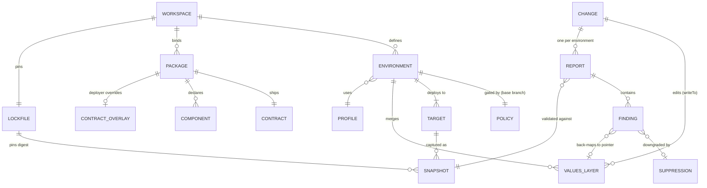
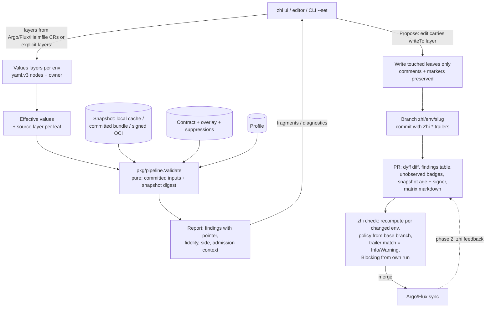

# zhi rewrite — Design v2

*Lead architect revision, 2026-09-13. Design v1 (pr-native skeleton with grafts from engine-first, contract-first, fleet-and-evidence and minimalist) revised against three adversarial critiques: the CNCF-ecosystem veteran (C1), the Kubernetes API-machinery engineer (C2) and the consultant/developer walkthrough (C3). No critique found a fatal flaw; every major finding is a section-level correction, and every one is either applied below or rejected with evidence in §14. Citations: `report §n` = landscape synthesis; `audit §n` = zhi audit brief; `persona brief`, `embed brief`, `fidelity brief`, `deployer brief`, `competitors brief` = the persona and gap briefs; slice briefs by name.*

---

## 0. Decision summary

1. **What we build, in one sentence, and it is the only positioning line:** *zhi is the PR check that already knows your cluster.* One static Go binary (`CGO_ENABLED=0`) renders Helm/Kustomize (Compose from month 6) with the real engines, runs the target cluster's admission chain offline against a **snapshot** of that cluster in the apiserver's own order, and opens the PR into the folder Argo CD or Flux already watch. Git is the only write target; zhi never applies; no in-cluster component, no hosted control plane (report §1, §8; competitors brief Task C). The form is described everywhere as "the consultant's editor for that check", never as the product — form-first Kubernetes UIs have the worst survival record in the evidence (Cyclops, Glasskube, Kubeapps, Weave GitOps).
2. **The wedge ships first and exits on calibration, not LOC.** M1 (months 2–4) is CLI-only: `zhi snapshot import → zhi validate --exit-code → zhi propose → zhi check`. It exits when Tier-0 findings agree with `--dry-run=server` on three fixture clusters (kind, one OpenShift, one managed) for ≥90 % of admission-stage findings, the golden suite renders byte-identically twice, and one per-minor port refresh (1.36→1.37) has been done. LOC is reported as an outcome (C2 major 10; this repo produced ~21k non-test LOC/month during its build burst, so writing speed is not the constraint — calibrating an admission emulator is).
3. **Build order is CLI → bot → form; the cut order is a different list:** T2 opt-in gate, Rego, extra profiles, LSP/MCP, GitLab-specific MR posting, then the form. **Compose is no longer on the cut list** — it is already scheduled (schema tier month 6, host tier phase 2) and cutting a deferral is a second cut (C1/C3 majors on Compose). The SCM-agnostic check (exit code + Markdown/JSON/SARIF files) is M1, so GitLab estates are served before any GitLab-specific code exists.
4. **Domain model = contract-first's**, RFC 6901 JSON Pointer everywhere; the finding is the JSON Schema 2020-12 output unit extended with severity, fidelity, lineage, admission context and persona side (report §4.8, §9 #11). New in v2: every edit carries a **target layer** (`writeTo`), and **suppressions** are an M1 entity.
5. **`pkg/pipeline.Validate` is a pure function of committed inputs plus a digest-pinned snapshot**, and determinism is engineered, not assumed: non-deterministic Sprig functions are replaced through Helm's `CustomTemplateFuncs`. Byte-identical reports across surfaces are a CI-tested invariant; **report-digest equality is evidence in the PR, never a merge gate** — `zhi check` always recomputes and decides Blocking from its own run (C1/C2/C3 majors on the trailer rule).
6. **The developer↔deployer contract is three standard-compatible files** — `values.schema.json` (2020-12 with `x-zhi-*` keywords, no `$vocabulary`), `values.cel.yaml`, `zhi/requirements.yaml` — **plus the deployer-owned overlay** at `.zhi/contracts/<package>/`. Only the schema is enforced by anything outside zhi (Helm 4), so the no-developer-contract path is the primary MVP demo and `zhi contract init` synthesises the rest.
7. **Snapshots are local first, shared second, signed third.** `zhi snapshot import` writes an unsigned snapshot to gitignored `.zhi/cache/`; `zhi snapshot commit`/`zhi bundle export` shares it through the repo or a tarball; `zhi snapshot push` publishes a cosign-v3-signed OCI artifact. All three are first-class; signature is required only where `.zhi/policy/<env>.yaml` says `requireSigned: true`. Three slices — `schema`, `policy`, `full` — plus a namespace filter; only `schema` crosses the invisible border by default (C1 major 2, C3 majors 5–6).
8. **Fidelity is in the Finding type**, and the chain now mirrors the apiserver: all mutators in plugin order, then decode-level defaulting and structural/CRD-CEL validation, then all validators with ResourceQuota last (C2 major 1). Expanded Pods carry the owning controller's identity; engines with autogen receive unexpanded workloads (C2 major 2).
9. **Unknowns policy (provisional, owner to confirm):** badges locally; `--strict` in `zhi check` promotes them to Warnings; never Blocking. PRs whose changes are confined to machine-owned pointers are exempt from promotion and headline "no new findings vs base".
10. **OpenShift ships in the MVP as a data-tier profile**: existing-namespace UID/GID-range arithmetic (Blocking, `approximate`), the new-namespace placeholder Warning, `namespaceProvisioning: projectrequest | direct` (default `direct`), Route host collisions, IDMS/ITMS, `ClusterResourceQuota`. SCC emulation is a **port** of `sccmatching` to external types, gated on a re-scoped sizing spike — it cannot build against v0.37.0 without replaces (C2 major 5).
11. **Both matrices ship in the MVP as text**; `zhi matrix --compat` accepts several workspaces (`fleet.yaml`) so the supporter with eleven customers gets one table.
12. **Plugin depth: shallow — zero loadable plugins in v1, two doors defined.** `Check` and `Resolver` are Go interfaces with one implementation each; `check/v1` externalises as digest-pinned exec binaries with a JSON contract; no proto, no go-plugin, no marketplace until a second implementor exists (report §7.3; audit lesson 6). Unchanged by any critique.
13. **Not built:** the four gRPC plugin types, transforms, the store layer, the TUI, the marketplace, Yaegi validators, `text/template`+Sprig as the Kubernetes bridge, a database, a hydrated-branch writer in v1, Kargo `http`-step and gitops-promoter `CommitStatus` providers (they presuppose a server), an in-cluster component in v1. A stateless `zhi serve` wrapper over `pkg/pipeline` is a phase-2 option only against a named request.
14. **MVP = "a consultant validates and proposes a Helm values change for one Kubernetes environment, end to end, with a form, an OpenShift data profile and an SCM check"** — eight months for two people, twelve-plus for one, preceded by a six-week spike sprint. Environment *binding* and environment *policy* are two files with different owners so the transition to developer-owned environments never hands the PR author the bot's safety envelope (C3 major 11).
15. **Measured, not promised.** Sixteen spikes with pass/fail criteria precede architecture freeze; nobody's "<2 s" is measured, Helm emits no template source map, and two spikes (S4, S11) are now ports, not forks, because their premises were refuted before running.

---

## 1. Thesis and personas

### 1.1 Thesis

*zhi is `helm template | kubeconform | kyverno apply` grown up into one binary that already knows your cluster, and it opens the PR for you.* The first real admission check today is post-merge by construction — Argo polls every 120 s + 60 s jitter, Flux per `spec.interval`, CI queues add 30–60 minutes, median time-to-detect is ~40 minutes (report §3.2). Every evidenced failure class is visible only in rendered manifests against the target cluster's constraints (report §3.1).

The engine half is partly commodity and the design says so: Kyverno's `podSecurity` rule runs the PSA library offline via the CLI, the Kyverno Playground backend already loads cluster resources, VAP bindings, exceptions and CRDs from a live cluster, Flux Schema covers CRD/CEL (C1 minor; competitors brief). The durable moat is five things nobody ships: **(1)** a portable, redactable, signed snapshot format with per-layer degradation; **(2)** quota/LimitRange arithmetic across the namespace, controller-RBAC resolution and class/inventory catalogs; **(3)** the two-persona contract with a deployer-owned overlay; **(4)** the PR writer onto the branch the controller watches; **(5)** Compose parity (report §8 "what nobody does"; competitors brief). The evaluation half is deliberately interoperable — Kyverno-context, kubeconform, kubectl-validate, gator and flux-schema export adapters ship in M1 — so a Kyverno-native platform team can adopt the snapshot without adopting the engine.

### 1.2 Developers (author side)

They own the chart, the Compose file and the **contract**: what is configurable, its types, defaults, enums, UI hints, cross-value rules, and what the environment must provide. They stay in their tooling: the contract is `values.schema.json` (Helm 4 validates it natively with the same library zhi uses), `values.cel.yaml` in the helm-cel pattern, and a Troubleshoot-compatible `requirements.yaml` (report §6.1–6.2; persona brief implications 1–2). These are *standard-compatible*, not standard-enforced: only the schema pays off without zhi, so the honest developer incentive is stated plainly — fewer support tickets across the border, made visible by the `side: developer` count per chart in every PR table (C3 minor).

**What developers get in M1**, not month 5: a chart-repo workspace shape — a minimal `zhi.yaml` binding `package: .` to `fixtures: [profile://openshift-4.20, profile://vanilla-1.37, snapshot://…]` — so `zhi validate --fixture profile://openshift-4.20` runs with no customer data because profiles double as synthetic snapshots (default SCCs, `restricted` PSA, common quotas); and `zhi contract emit`, which produces a Helm-4-valid `values.schema.json` from the synthesis passes (§4) and a helm-cel-runnable `values.cel.yaml` skeleton, so the first developer-side finding from the bot arrives with a one-command fix (C3 major 12, minor 1). `zhi contract lint|test` (months 5–6) add the conformance table.

### 1.3 Consultants and supporters (deploy side)

They own the GitOps repo and the target environment. The first-hour path is rewritten around what a consultant actually has on day one — a namespace-scoped identity, no registry, no signing key, no platform team (C1 major 2; C3 majors 5–6):

1. **Any authenticated identity → discovery tier.** `zhi snapshot import --context eu-prod` with only discovery + `/openapi/v3` + version rights yields a `slice: discovery` snapshot in `.zhi/cache/` (gitignored, unsigned) that already gives T0-a: schema, removed APIs, CRD CEL from the OpenAPI document (cluster-state-import brief implication 2).
2. **`zhi snapshot rbac` emits two ClusterRoles and one Role** — cluster-scoped read (CRDs, VAP/MAP, engine policies, classes), namespaced read (quota, LimitRange, ConfigMaps, ESO objects, workloads), and an *optional* namespaced Secrets rule printed in red with the comment "this grant reads Secret contents; expected to be refused" — so the security reviewer can approve the first two and scope the third (Kubernetes RBAC good practices: `list`/`watch` on secrets reveal contents).
3. **`zhi validate --env eu-prod`** runs against the values files already in the repo, with layers discovered from Argo/Flux CRs, Helmfile, or an explicit `layers:` list for plain `helm upgrade -f` estates (§5.1); the report header carries "unsigned local snapshot" until the snapshot is shared and signed.
4. **`zhi ui`** opens a form generated from the contract — synthesised into the overlay when the chart ships none — with cluster-aware pickers fed from the snapshot's catalogs and, where ESO is present, from `ExternalSecret` objects as evidence of Secret names and keys (Rancher's live pickers, offline; persona brief implication 5).

Findings that back-map today are phrased against the field: "`persistence.storageClass: standard` cannot provide ReadWriteMany in eu-prod (no RWX-capable CSIDriver)", "`ingress.className: nginx` is not an IngressClass in eu-prod (available: openshift-default)". Pod-security findings on vendor charts — `runAsUser` hard-coded in a template — land **developer-side** anchored on the rendered Pod: "not yours to fix, send it back across the border" (C3 major 1; pr-native §4.6). Because a Blocking finding on a chart the consultant cannot change must not be a dead end, v1 ships the workaround path: `.zhi/suppressions.yaml` (finding-id, reason, owner, expiry, side) turns a suppressed Blocking into a listed Warning in the PR table; the overlay may add `x-zhi-targets` and a `proposedValue`; `zhi explain <id>` prints the chart values keys whose fingerprint matches the flagged rendered pointer; and `zhi propose --allow-blocking <id>…` (default refuse) writes a `Zhi-Override:` trailer with the reason.

### 1.4 Who stops paying for what

Report §3.1's classes map to the persona that stops paying: developers stop shipping charts that assume privileged dev clusters (class 7 PSA, OpenShift SCC/UID) and charts whose contract lies (class 2); deployers stop discovering quota (8), missing references (10), removed APIs (4), policy denials (6), controller RBAC (12) and wrong effective values (16) after merge. That mapping goes on the landing page under the one positioning line (persona lens best idea 1).

### 1.5 The third role and the transition

Platform teams get a third role: they own snapshot refresh and distribution profiles without owning anybody's values. At a customer the platform team is often not the buyer and may never run a refresh job, so nothing in the design *depends* on them (C1 major 7): a consultant refreshes from a laptop, and `zhi snapshot refresh --layers quota,namespaces` re-imports only the layers that go stale fastest with a namespace-scoped identity.

The transition changes no artifact. What changes is CODEOWNERS — with one correction to v1: the environment definition is **two files**. `.zhi/environments/<env>.yaml` is the *binding* (targets, namespaces, GitOps CR refs, values layers, matrix dimensions) and moves to whoever deploys; `.zhi/policy/<env>.yaml` is the *safety envelope* (`allowExec`, `allowDirectPush`, `allowEgress`, snapshot `maxAge`/`staleAction`/`requireSigned`, profile pin, `strict` default, suppression approval) and stays with the platform/security side. `zhi check` reads policy only from the base branch, so a PR can never loosen its own gate (C3 major 11). `x-zhi-persona` remains a grouping hint; role separation stays in Git permissions. The mentoring loop is `zhi contract test` in chart CI.

---

## 2. Domain model

### 2.1 Addressing and identity

**JSON Pointer (RFC 6901) everywhere** — values (`/persistence/storageClass`), rendered documents, findings (`instanceLocation`); `~1` escapes `app.kubernetes.io/name`. The current flat slash path with its `[a-z]` regex cannot express list indices or camelCase keys and is dropped (audit §1.1). Manifests are identified by `file + apiVersion/kind/namespace/name`; Compose services by `file + service`. Every YAML node carries a yaml.v3 position so findings cite `values-prod.yaml:42:7`.

### 2.2 Entities

| Entity | Identity | Lives in | Notes |
|---|---|---|---|
| **Workspace** | Git remote + `.zhi/workspace.yaml` | GitOps repo (or chart repo, minimal form) | Environments, packages, SCM provider, `checks:`; chart-repo form binds `package: .` to `fixtures:` |
| **Package** | `kind ∈ {helm, kustomize, compose}` + source ref + digest | App/chart repo or OCI | Git-path and Helm-repo packages first-class; no forced OCI republish |
| **Contract** | digest of the three files | Inside the chart | Developer-authored; components as `x-zhi-component` |
| **Contract overlay** | `.zhi/contracts/<package>/` | GitOps repo | Deployer-owned; merged over the shipped contract; home of synthesised schemas and of `x-zhi-targets`/`proposedValue` workarounds |
| **Environment (binding)** | `name` | `.zhi/environments/<name>.yaml` | Promotion order, targets 1:N, namespaces, GitOps binding *or* explicit `layers:` list, `namespaceProvisioning`, matrix dimensions — owned by whoever deploys |
| **Environment policy** | `name` | `.zhi/policy/<name>.yaml` (or workspace `policy:`) | `allowExec`, `allowDirectPush`, `allowEgress`, snapshot source + `maxAge` per layer + `staleAction` + `requireSigned`, profile pin, `strict`, who may approve suppressions — owned by platform/security; read from the base branch only |
| **Target** | K8s: `kube-system` UID + apiserver URL hash; Compose: engine id | Snapshot provenance | Kube-context is a local hint, never committed |
| **Snapshot** | `sha256` of manifest | `.zhi/cache/` (local), `.zhi/snapshots/<env>/` or bundle (shared), OCI (signed) | Layers §3.5; `slice ∈ {discovery, schema, policy, full}`; `namespaces:` filter; `declared.yaml` overlay |
| **Profile** | `openshift-4.20@sha256`… | Built in + OCI, pinned in `zhi.lock` | Data + small Go emulators; doubles as a synthetic snapshot for `--fixture` |
| **Values layer** | `(env, rank, file, pointerPrefix, owner)` | GitOps repo | `chart defaults < common < variant < env < cluster < runtime < machine-managed`; `owner ∈ {human, machine:renovate, machine:image-updater, controller}`; machine-owned read-only |
| **Effective values** | derived | memory | Helm coalesce semantics; each leaf carries its source layer |
| **Change** | branch + SHA(s) | worktree → PR | Every edit carries `writeTo: <layer>` |
| **Rendered set** | digest of canonical manifests | ephemeral | Lineage where recoverable (§3.7); `generated-at-render` values excluded from digests |
| **Finding** | hash of `(engine, ruleId, resourceId, instanceLocation, keywordLocation, valuesPointer)` | Report | §2.4. S16 (2026-09-18): the 4-tuple collided because JSON Schema output units for `required` and defaulted properties anchor at the parent instance (`instanceLocation ""`); `keywordLocation` and `valuesPointer` were added to the identity |
| **Suppression** | finding id | `.zhi/suppressions.yaml` | `{reason, owner, expires, side}`; expiry mandatory; suppressed Blocking → listed Warning |
| **Report** | digest of canonical JSON | PR check output; OCI referrer; never committed | Deterministic |
| **Component** | name per package | Contract + env state | Graph, cycles, mandatory pre-enable, cascade refusal carried from `internal/core/component.go`; subchart → Helm `condition`, in-chart → declared `enabledPointer`, Kustomize `Component`, Compose `profiles` |
| **Secret reference** | `ref://<store>/<path>#<key>[@version]` | values files | A validation-time type in M1 resolving to the chart's existing-secret convention; `ExternalSecret` emission only where a manifests path is provably applied (§5.2) |
| **Lockfile** | `zhi.lock` | GitOps repo | Digests of snapshots, profiles, downloaded adapter binaries, checks; `bin/` directory for offline binaries |

### 2.3 Diagram



### 2.4 The finding record

```
Finding {
  id, severity ∈ {Info, Warning, Blocking}, message
  engine, ruleId, policyRef {name, version}
  resource {file, apiVersion, kind, namespace, name}   # or {file, service}
  instanceLocation, keywordLocation                    # 2020-12 output unit
  valuesPointer?, layer?, source {file, line, col}?
  lineage ∈ {targets, fingerprint, sentinel, none}
  admissionContext {user, operation, expandedFrom?}    # identity the finding was evaluated with
  fidelity {tier ∈ {t0a, t0b, t2}, exactness ∈ {exact, approximate, predicted}, unobserved []}
  wouldFailAt ∈ {schema, admission, scheduling, runtime}
  side ∈ {deployer, developer, platform}
  suppressedBy?, proposedValue?
}
```

Severity mapping is fixed in core: schema/CEL/Deny/Enforce/Preflight-fail → Blocking; VAP Warn, Kyverno Audit, Gatekeeper warn/dryrun, PSA warn/audit, webhook match, stale quota, native-approximate → Warning; deprecation-in, annotations → Info; PolicyExceptions and `enforcementAction` honoured (report §9 #9).

### 2.5 What lives where

Git: workspace, environment bindings, policies, values, overlays, lockfile, suppressions, optionally a shared snapshot. OCI: signed snapshots, profiles, adapter binaries, reports as referrers. Nowhere persistent: kubeconfigs, store tokens, decrypted secrets, session state. Reports are never committed.

---

## 3. Architecture

### 3.1 Binary and packages

One module, one binary, `CGO_ENABLED=0`, `k8s.io/* v0.37.0`, `helm.sh/helm/v4 v4.3.0`, `sigs.k8s.io/kustomize/api v0.21.1`, `santhosh-tekuri/jsonschema/v6 v6.0.3`, kubectl-validate by pseudo-version (S1 verifies it compiles and passes its own tests under MVS at v0.37.0), `compose-go/v2 v2.15.0` from month 5, `homeport/dyff`, `replicatedhq/troubleshoot` (analyzers), `oras-go/v2`, `sigstore-go v1.3.0`; **no `replace` directives; no `k8s.io/kubernetes` module** (embed brief §0, §5). CEL: cel-go is imported only at the path `k8s.io/apiserver` pins (`github.com/google/cel-go v0.29.2` today), never `cel.dev/cel-go`; environments come from `environment.MustBaseEnvSet(snapshotMinor)`, extended with `cel.Variable` bindings; snapshot policies compile with `StoredExpressions`, contract rules with `NewExpressions` so they can be promoted to a cluster VAP unchanged (C2 minor). OPA/Gatekeeper stay out of `go.mod` until Rego is evaluated.

```
cmd/zhi                          Cobra; all surfaces
pkg/pipeline                     Validate(ctx, Workspace, Env, Options) → (Report, error)
pkg/report                       versioned finding/report types; canonical JSON + digest; JSON/SARIF/PolicyReport/markdown
pkg/check, pkg/resolver          the two doors (§8)
internal/workspace               workspace, environment bindings, policy files, zhi.lock, suppressions
internal/layout/{argo,flux,helmfile,plain}   layer discovery; fleet as a declarative file-pattern map
internal/values                  yaml.v3 nodes, JSON Pointer, layer fold, writeTo, comment-preserving write-back, lineage
internal/contract                schema ingest + x-zhi keywords + CEL compile + overlay merge + synthesis + conformance
internal/render/{helm,kustomize,compose}     Helm v4 SDK (snapshot Capabilities/lookup, deterministic funcs), krusty, compose-go
internal/snapshot                format, importer tiers, redaction, sigstore-go verify chokepoint, OCI/bundle, exporters, rbac generator
internal/admit                   ordered chain (§3.3): pre/, mutate/, schema/, validate/, post/
internal/admit/port/{limitranger,quota,rbacrules,mapcompile}   PORTS from kubernetes@v1.37.0 to external types (+ NOTICES)
internal/engines                 exec adapters: kyverno (kwctl phase 2); lockfile-pinned; zhi-owned exit codes
internal/profile                 profiles as data + Go emulators (openshift data tier in MVP)
internal/require                 Troubleshoot analyzers on a snapshot-as-bundle adapter + zhi analyzers
internal/matrix                  compatibility and validity matrices (derived; multi-workspace)
internal/finding                 canonical record, severity, back-mapping, suppression
internal/scm/{generic,github}    generic: exit codes + files; github: Check Run annotations (gitlab/ months 5–6 if S14 says so)
internal/git                     system git by configured path + version floor (carried apply.go runner)
internal/ui                      htmx shell; form renderer; session API with writeTo
internal/lsp, internal/mcp       phase 2 / phase 3
```

### 3.2 Edit → PR data flow



(1) `internal/layout` builds the layer stack per environment from controller CRs, Helmfile, or the explicit list; runtime layers (`substituteFrom` ConfigMaps) come from the snapshot's `gitops/` layer *with data*, since without it every `${VAR}` without default becomes a false Blocking (C2 major 8). (2) Contract resolved, overlay merged, suppressions loaded, form generated. (3) Every edit posts to the session; stage 0–1 runs per keystroke, the rendered chain on a 500 ms–1 s debounce with cancellation and a visible "revalidating…" state (C3 minor). A Blocking finding on save is refused and the field re-rendered (audit §3.2). (4) Propose writes only touched leaves to their `writeTo` layer, commits with trailers, opens the PR. (5) `zhi check` recomputes every environment whose files changed; trailer agreement is reported, not gated (§5.4). (6) Post-merge feedback is phase 2.

### 3.3 Render → validate pipeline, in the apiserver's order

v1's order ran PodSecurity, ResourceQuota, LimitRanger-validate and CRD CEL *before* MAP/Kyverno mutation. The real apiserver runs every mutating plugin's `Admit` in plugin order, then `rest.BeforeCreate` (defaulting + strategy validation including CRD CEL), then every validating plugin's `Validate` in order with ResourceQuota last; PodSecurity and ResourceQuota are validation-only plugins (C2 major 1: `pkg/kubeapiserver/options/plugins.go` `AllOrderedPlugins`; `admission/chain.go`; `registry/generic/registry/store.go`). A MAP rule injecting a `securityContext` or default resources — the two most common mutations — must be seen by PSA and quota. v2's chain:

**P — zhi pre-stages (values side).**
- P0 **Fold** layers → effective values with source layer.
- P1 **Contract** (before render, so the deployer gets feedback even when the chart cannot render): JSON Schema over merged values with Helm 4's merged-`.Values`-vs-all-subchart-schemas semantics; `values.cel.yaml` rules with `values`, `oldValues`, `env`. Rules over `rendered`/`snapshot` compile here and run at Z6.
- P2 **Render** with the real engine: Helm v4 SDK with `Capabilities` and `lookup` from the snapshot (`RenderWithClientProvider`), deterministic replacements for `randAlphaNum`, `randAlpha`, `randNumeric`, `uuidv4`, `now`, `genCA`, `genSelfSignedCert`, `genSignedCert`, `derivePassword`, `htpasswd`, `bcrypt` installed via `CustomTemplateFuncs` and seeded from the report inputs; Secrets whose values came from those functions are tagged `generated-at-render` and excluded from diffs and digests (Bitnami's `common.secrets.passwords.manage` generates a password whenever `lookup` finds none, and with a names-only inventory it always finds none) (C2 major 7). Kustomize via krusty; Compose via compose-go (§6). Exec renderers are phase 2, allowlisted.
- P3 **Discovery**: removed GVK on the target minor from the discovery document; served-but-deprecated versions from a small built-in table with pluto's `deprecated-in/removed-in` semantics, refreshed per minor (Info) (C2 minor).
- P4 **Expand** workloads to Pod templates **with their own admission context**: user = the owning controller's ServiceAccount (`system:serviceaccount:kube-system:replicaset-controller` for Deployments; `statefulset-controller`, `daemon-set-controller`, `job-controller`, `cronjob-controller` likewise), operation CREATE, `ownerReferences` and `pod-template-hash` synthesised, template labels carried, namespace inherited. Objects are routed per engine: **engines with autogen (Kyverno) receive unexpanded workloads only**; native stages (PSA, quota, LimitRanger, VAP, generated-VAP) receive expanded Pods; findings are deduplicated by `(engine, ruleId, template pointer)`; the identity used is recorded in `admissionContext`, and `unobserved` gets `controller-rbac` when the snapshot lacks that SA's bindings (C2 major 2; PSA docs: enforce applies only to the resulting Pods; Kyverno autogen docs).

**M — mutators, in apiserver order** (each shown as an Info diff, "what the cluster will store"): LimitRanger defaults → ServiceAccount (default SA, `imagePullSecrets`) → Priority (resolve `priorityClassName`) → DefaultTolerationSeconds → DefaultStorageClass → RuntimeClass → DefaultIngressClass → MutatingAdmissionPolicy (via the copied compile path, §10 S2) → Kyverno mutate (first CLI pass; patched output taken) → profile mutators (OpenShift SCC assignment when S11 lands; AKS safeguards and Autopilot ratios phase 2).

**S — decode-level defaulting, pruning, structural schema and CRD CEL on the mutated object** via kubectl-validate's `customresource.NewStrategy` path with the server's cost constants; CRDs `exact`, native types `approximate` because KEP-5073 rules are not published (fidelity brief §1).

**V — validators, in apiserver order:** NamespaceLifecycle (namespace exists in the snapshot or is created in this change; on OpenShift the project-request template is injected only when the environment declares `namespaceProvisioning: projectrequest` — a `kind: Namespace` created by Argo `CreateNamespace=true` or a Flux Kustomization never goes through the `projectrequests` REST path, so under the default `direct` zhi emits "namespace created directly by the controller; project template quota/LimitRange/NetworkPolicy/RoleBindings will not be applied" (C2 major 9)) → LimitRanger validate → PodSecurity (`pod-security-admission/policy`; cluster defaults/exemptions from `declared.yaml` or the profile) → Priority/RuntimeClass existence → ValidatingAdmissionPolicy (`validating.NewValidator` + `cel.NewCompositedCompiler` as Gatekeeper's `k8scel` driver does, with params, `namespaceObject`, an RBAC-backed `authorizer` resolved from the `rbac/` layer) → Kyverno validate (second CLI pass on mutated objects, `--context-file`, `--parameter-resource`, `--userinfo`, `--policy-report`) + Gatekeeper via the cluster's **generated** VAP/VAPB (Rego templates "not evaluated" until phase 2) + Kubewarden via kwctl (phase 2) → webhook match prediction (which `*WebhookConfiguration` rules the request hits; logic unknown → Warning; vendor webhooks claimed by profiles to avoid double counting) → **ResourceQuota last**, computed twice per namespace: *steady state* = `used − oldPods(workload) + replicas × podUsage` and *rollout peak* = steady + surge pods honouring `maxSurge`/`maxUnavailable` (default 25 %), StatefulSet/DaemonSet semantics and Job parallelism; scopes and `scopeSelector` via the ported `MatchingScopes`; `count/<resource>.<group>` object counts; storage-class-scoped PVC quota after DefaultStorageClass has run. The old-revision subtraction needs per-namespace aggregated Pod requests (no secrets) in the `full` slice; without them the finding is labelled `approximate`; `status.used` older than the quota layer's `maxAge` → Warning. OpenShift `ClusterResourceQuota` is summed across selected namespaces with the same two numbers (C2 major 3).

**Z — zhi post-stages.** Z1 RBAC: ported `RulesAllow`/`RuleAllows` (external types) plus a ~150-line rule resolver over the snapshot's Roles/Bindings for the controller identity and each expanded object's controller SA. Z2 References and catalogs: Secret/ConfigMap names+keys (degrading to `unobserved: ["inventory:secrets"]`), ServiceAccounts, StorageClass + CSIDriver capability (`rwxCapable ∈ {true,false,unknown}`), IngressClass/GatewayClass, PriorityClass, RuntimeClass, image allow/block lists + IDMS/ITMS, Route/Ingress host collisions. Z3 Immutable fields: CRD `oldSelf` rules (exact); native hand-maintained table (approximate). Z4 Requirements: the contract's analyzers with chosen values substituted. Z5 Component rules. Z6 Developer CEL over `rendered` and `snapshot`. Z7 Profile checks; then normalise → back-map → suppress → severity → tier → digest.

Exit codes: 0 clean, 1 Blocking, `--warn-exit-code N`, 3 tool error; zhi owns every exec adapter's exit code (report §3.3 Kyverno v1.12 exit-0-on-FAIL).

### 3.4 Fidelity tiers

| Tier | In v1 | Mechanism | Label |
|---|---|---|---|
| T0-a | default; any authenticated identity | P1, P3, S | `t0a`; `exact` (CRD) / `approximate` (native) |
| T0-b | default | M, V, Z in-process + Kyverno subprocess | `t0b`; `unobserved: ["psa-exemptions", "authorizer-assumed-allow", "webhook:3", "static-policies-1.37+", "inventory:secrets", "controller-rbac"]` |
| T2 | opt-in (`zhi validate --live`) | in-process client-go SSA dry-run (`DryRun: ["All"]`, `FieldValidation: "Strict"`) with the controller's fieldManager; Argo `server-side-diff`; `flux diff kustomization` — no kubectl exec (C2 minor) | `t2`; separate delta with explanation |
| T1 | phase 3, S15-gated | envtest/KWOK hydrated from the snapshot | — |

The report header carries `schema-valid`, `apiserver-valid (CRDs exact, native approximate)`, `policy-valid (N rules skipped needing live data)` and nothing stronger; the UI never renders "will apply". T2 doubles as the calibration oracle in the golden suite, **with defined coverage**: only findings with `wouldFailAt: admission` on pre-existing namespaces, identity-normalised, are compared; expansion-derived findings (PSA/quota on controller-created Pods) are oracle-less and are calibrated against a real apply in the kind fixture (C2 minor; fidelity brief §5).

### 3.5 Snapshot: tiers, slices, format, freshness

**Three storage tiers, all first-class.** *Local* — `zhi snapshot import` writes to `.zhi/cache/snapshots/<digest>/`, gitignored, unsigned; every command accepts it; the report and PR header say "unsigned local snapshot". *Shared* — `zhi snapshot commit --env X` writes `.zhi/snapshots/<env>/` (Git LFS for `full`) or `zhi bundle export` writes a tarball (the carried `zhi-mirror` bundle format: `oci-layout`, `bundle.json`, digest-verified blobs); `zhi.lock` pins the digest; signing optional, `signed: false` shown in the PR header. *Published* — `zhi snapshot push` to an OCI registry as one artifact (one tar blob per layer, `manifest.json` config, cosign v3 protobuf bundle as a referrer). **Signer named:** a platform refresh job signs keyless where Fulcio/Rekor egress exists; a consultant signs key-based (`cosign.key`, KMS) — keyless is impossible fully offline (deployer brief Part 2 item 7). **Verification is in-process via sigstore-go** against a pinned `trusted_root.json`, one function in `internal/snapshot/verify.go`, golden-tested against bundles produced by cosign v3.1.3: single binary, no 100 MB download, no "who verifies cosign" bootstrap; exec-cosign was the alternative and is rejected for that bootstrap question (C2 minor; audit lesson 7: wire the chokepoint first). Datree's post-mortem — value that lived in a hosted registry died — is why local and shared come before published (competitors brief Task C).

**Three slices plus a filter.** `schema` (discovery, OpenAPI, CRDs, catalog *names*) is the default border-crossing artifact for developers. `policy` (VAP/MAP + params, webhook metadata, engine policies) requires explicit customer opt-in recorded in `manifest.json` with the redaction-policy digest — policy bodies and params carry allow-lists, registries, hostnames and tenant names that are a customer's security posture (C1 minor; C2 minor; C3 major 12); params default to `full`. `full` (namespaces, rbac, inventory, gitops, nodes) is confidential; `--namespaces` produces a namespace-scoped `full` for the developer-deploys-own-namespace transition. Redaction is a tested layer with golden fixtures.

**Import tiers by RBAC.** `discovery` (any identity), cluster-read ClusterRole, namespaced-read Role, optional namespaced Secrets rule. `zhi snapshot rbac` prints all of them with a comment per rule naming the layer it feeds and the Secrets rule in red. Degradation is per layer, recorded in `manifest.json`, and the degraded UX is defined: the `secret-key` picker becomes free text with an `unobserved` badge; class 10 and `ref://` store checks report `unobserved` (Warning under `--strict`), never Blocking (C3 major 5).

```
manifest.json      schemaVersion, clusterId, serverVersion, capturedAt, capturedBy, importerVersion,
                   slice, namespaces[], signed, signer, ttl, profileId, redactionPolicyDigest, policyOptIn,
                   engines {kyverno, gatekeeper, kubewarden}, featureState {mapApiVersion: v1|v1beta1},
                   layers [{name, digest, resourceVersion, capturedAt, degraded: "secrets: forbidden"}]
discovery/         APIGroupDiscoveryList                                                  [schema]
openapi/           kubectl-validate layout, ?hash= keyed                                  [schema]
crds/              raw CRDs, x-kubernetes-validations intact                              [schema]
catalogs/names     StorageClass/IngressClass/GatewayClass/PriorityClass/RuntimeClass/SCC names [schema]
catalogs/          full objects incl. CSIDriver capabilities, ComputeClass/NodePool/NodeClass [policy]
admission/         VAP/VAPB, MAP/MAPB as admissionregistration.k8s.io/v1 YAML (v1beta1 on 1.34/1.35) [policy]
admission/params/  paramKind objects, redacted                                            [full by default]
admission/webhooks/ Validating/MutatingWebhookConfiguration metadata                      [policy]
engines/           Kyverno/Gatekeeper/Kubewarden policies, exceptions, generated VAP/VAPB  [policy]
namespaces/<ns>/   labels/annotations, ResourceQuota spec+status, LimitRange, NetworkPolicy, aggregated Pod requests [full]
rbac/              Roles/ClusterRoles/bindings; subjectrules/ only for the importer's own identity [full]
inventory/         ConfigMaps verbatim (operator deny-list); Secrets names (+keys, opt-in; length-preserving sentinels optional);
                   ESO ExternalSecret/SecretStore objects as key evidence; ServiceAccounts, Services, Ingress/Routes, workloads [full]
gitops/            Applications/ApplicationSets, HelmReleases/Kustomizations, substituteFrom data, Sealed Secrets cert, Kargo Stages [full]
nodes/             optional: allocatable, labels, taints                                  [full]
declared.yaml      operator overlay: PSA defaults/exemptions, static .static.k8s.io bundle dir, webhook stubs, PSACT, profile id
```

ConfigMap *data* is an input to Kyverno `context.configMap`, Flux `substituteFrom` and Helm `lookup`, so it is verbatim in `full` behind a deny-list rather than redacted to keys (C2 major 8). Controller RBAC is resolved offline from `rbac/`; `SelfSubjectRulesReview` for another identity would need `impersonate`, which a security review rejects. The static-manifest export adapter is lossy by design (static policies forbid `paramKind`/`paramRef`) and documents dropped bindings.

**Freshness is per layer and warns by default.** Defaults: quota status 24 h, namespaces/inventory 7 d, policies/CRDs/discovery 90 d — each beyond its `maxAge` → Warning naming who last refreshed and the one-line `zhi snapshot refresh --layers …` fix, in the PR comment. `staleAction: block` in the policy file is a per-environment opt-in (recommended for prod). `zhi open` never refuses; it badges (C1 major 7; C3 major 10). Kyverno's engine version is recorded and the matching CLI pinned by digest; several may be pinned across the 1.20 ClusterPolicy removal.

### 3.6 UI stack

Shell: Go `html/template` + htmx, embedded, no build step, reusing the carried middleware chain and its solved interactions (audit §3.2, §7.1). Panes: tree, generated form, form ↔ YAML toggle, rendered manifests with the M-phase diff (dyff), findings grouped by severity with file:line and the side split, effective-values explorer, SSE log pane. Loopback, single user.

**Target layer.** The form edits effective values but writes to one file, and v1 never said which. Each edit carries `writeTo`, defaulting to the environment layer for `zhi ui --env X`, or to the leaf's current human-owned source layer when that is more specific; every field shows "currently from: `common/values.yaml` → will write to: `envs/eu-prod/values.yaml`" with a per-field override; machine-owned layers are refused; the YAML pane shows the *target layer file*, not the effective tree — the Rancher "Edit as YAML is not the values.yaml" trap avoided by construction (C3 major 2). S6 tests it on the company's layered files.

**Two cadences.** Stage P0–P1 per keystroke (in-process, milliseconds); M/S/V/Z on a 500 ms–1 s debounce with cancellation; the Kyverno stage moves to save-time when S7 shows its cold start exceeds the budget.

**Form generation is decided by S9**, whose criterion now measures the residual over the editor path, not only renderability. The Go-native renderer walks the compiled schema (object → fieldset, `enum` → select, `x-zhi-cluster-ref` → snapshot-fed select, `x-zhi-secret` → masked reference input, arrays → repeatable fieldsets, `x-zhi-advanced` hidden), with conditional visibility (`x-zhi-show-if`, components) evaluated **server-side in CEL** and returned as a visibility map so the browser runs no second expression language (Rancher #4706 lesson). Unexpressible shapes fall back to an embedded YAML editor bound to that subtree. The session API returns findings in RJSF `extraErrors` shape from day one. **S9 go/no-go:** ≥95 % of leaf fields typed on Bitnami redis plus two internal charts, no deployer-touched top-level group in YAML fallback, *and* the S14 task arm (three consultants perform the same two changes via editor+modeline+`zhi validate` and via the prototype form; time, errors, preference recorded) shows a residual worth the form's cost — otherwise the form becomes a single RJSF v6 island built once in CI and committed (C3 major 3).

### 3.7 Lineage

Helm emits no source map. Day-one lineage: (a) schema/values-stage findings carry a pointer; (b) `x-zhi-targets` entries of the shape `{kind, name?: glob, apiVersion?, pointer}` — a bare pointer is ambiguous once a chart has two workloads (C3 minor; Glasskube `targets` carried a target identifier); `zhi contract lint` verifies each target resolves in a rendered fixture; (c) scalar-fingerprint match of the flagged rendered value against unique effective-value leaves; (d) otherwise the finding anchors on the rendered document, tagged `developer-side`, and the consultant's workaround path (§1.3) applies. S10 measures (b)+(c) coverage and sentinel-substitution cost for phase 2.

### 3.8 CLI, CI, distribution, LSP, MCP

- **CLI:** `zhi snapshot {rbac,import,refresh,commit,push,verify,export,diff}`, `zhi bundle {export,import}`, `zhi env {import,list}`, `zhi contract {init,lint,emit,test,cel-doc}`, `zhi validate --env <e> | --fixture <ref> [--strict] [--live] [--format json|sarif|policyreport|md] [--exit-code]`, `zhi matrix [--compat|--change] [--fleet fleet.yaml]`, `zhi render`, `zhi diff`, `zhi propose [--allow-blocking <id>…]`, `zhi check`, `zhi ui`, `zhi explain <id>`.
- **CI, SCM-agnostic in M1:** `zhi check` produces an exit code plus Markdown, JSON, PolicyReport and SARIF files any CI can post — GitLab CI, Jenkins, Azure DevOps today. The GitHub-specific part is ~200 LOC: a Check Run with batched annotations (≤50 per update) from yaml.v3 positions, installed as a GitHub App because fork-PR tokens lack `checks: write`; SARIF upload is optional because code scanning on private repositories needs GitHub Code Security (C1 major 8; C2/C3 minors). A GitLab commit-status + MR-note adapter is scheduled for months 5–6 if S14's SCM mix exceeds ~30 % GitLab.
- **Distribution from M1:** single binary, a krew plugin and a `flux-zhi` CLI plugin (RFC-0013 catalog PR, SHA-256 + digest pin); export adapters to kubeconform, kubectl-validate, Kyverno context, gator and flux-schema layouts (C1 minors).
- **Editor for free, done right:** `zhi contract emit` writes *two* schemas — `.zhi/schema.json` (merged, with `required`) and `.zhi/schema.partial.json` (`required` stripped, types/enums/`additionalProperties` kept) — plus per-environment variants `.zhi/schema.<env>.json` with `x-zhi-cluster-ref` resolved to `enum` from the snapshot, so pickers exist in any editor in M1; the modeline in layer files points to the partial/per-env variant, never the merged schema, because Helm validates only the final merged `.Values` and a merged schema attached to a partial overlay flags every missing required key (C3 major 3).
- **LSP (phase 2):** diagnostics, hover with effective value + source layer, code actions applying `proposedValue`. **MCP (phase 3):** generated from the same command descriptors once `pkg/report` stabilises.

---

## 4. Developer ↔ deployer contract

Two developer-authored artifacts kept separate as KOTS keeps `Config` and `Preflight` separate (report §6.2; persona brief). **Consumed:** `values.schema.json` (drafts 4–2020-12), `# @schema`/`## @param`/helm-docs comments, ytt schema, Timoni `#Config` (phase 3), kro SimpleSchema, XRD/CRD schema, Rancher `questions.yaml` and OLM `x-descriptors` hints, Compose `${VAR:?}`. **Emitted:** `values.schema.json` with `x-zhi-*` in place, `Chart.yaml kubeVersion`, `templates/zhi-preflight.yaml` (Troubleshoot-native subset), the `.zhi/schema*.json` family + modeline.

**(a) `values.schema.json`.** v1 declared the vocabulary with `$vocabulary`; per JSON Schema 2020-12 core §8.1.2 `$vocabulary` "MUST be ignored in schema documents that are not being processed as a meta-schema", so the line was a no-op, and the alternative — a custom `$schema` meta-schema — would make Helm 4's `SchemeURLLoader` fetch it over https on every install (C1/C2 majors). v2: `$schema` stays the standard 2020-12 URI; unknown `x-zhi-*` keywords are annotations for every other validator by the unknown-keyword rule; zhi's own compiler calls `RegisterVocabulary(zhiVocab)` then `AssertVocabs()` so the keywords are syntax-checked by zhi.

```json
{
  "$schema": "https://json-schema.org/draft/2020-12/schema",
  "type": "object",
  "properties": {
    "replicaCount": { "type": "integer", "minimum": 1, "maximum": 20, "default": 1, "x-zhi-group": "Scaling" },
    "persistence": { "type": "object", "x-zhi-group": "Storage", "properties": {
      "accessMode":   { "enum": ["ReadWriteOnce", "ReadWriteMany"], "default": "ReadWriteOnce" },
      "storageClass": { "type": "string", "x-zhi-cluster-ref": "storageclass", "x-zhi-persona": "deployer",
                        "x-zhi-targets": [{ "kind": "StatefulSet", "pointer": "/spec/volumeClaimTemplates/0/spec/storageClassName" }],
                        "x-zhi-help": "Leave empty for the cluster default." } } },
    "db": { "type": "object", "properties": {
      "existingSecret": { "type": "string", "x-zhi-cluster-ref": "secret", "x-zhi-secret": true } } },
    "ingress": { "type": "object", "x-zhi-component": { "name": "ingress", "enabledPointer": "/ingress/enabled" },
      "properties": { "className": { "type": "string", "x-zhi-cluster-ref": "ingressclass" } } },
    "image": { "properties": { "tag": { "type": "string", "x-zhi-machine-managed": "renovate" } } }
  }
}
```

Keywords: `x-zhi-widget`, `x-zhi-group`, `x-zhi-order`, `x-zhi-help`, `x-zhi-secret`, `x-zhi-component` (`{name, enabledPointer}` for in-chart toggles; subcharts map to Helm `condition` — `condition`/`tags` apply only to `Chart.yaml` dependencies, so v1's blanket mapping was wrong for most components a deployer meets, C3 minor), `x-zhi-persona`, `x-zhi-advanced`, `x-zhi-show-if` (CEL, server-side), `x-zhi-immutable`, `x-zhi-machine-managed`, `x-zhi-targets`, `x-zhi-severity`, and `x-zhi-cluster-ref ∈ {storageclass, ingressclass, gatewayclass, namespace, secret, secret-key, configmap-key, serviceaccount, priorityclass, runtimeclass, secretstore, image}`.

**(b) `values.cel.yaml`** — helm-cel pattern, VAP variable conventions, compiled with `NewExpressions` in the k8s environment pinned to the snapshot's minor. CEL is statically typed, so the variable types are **published** as `zhi.dev/cel/v1` declarations and printed by `zhi contract cel-doc` (C3 minor): `Values`, `OldValues`, `Env{name, profile, storageClasses[]{name, provisioner, isDefault, rwxCapable: 'true'|'false'|'unknown'}, ingressClasses[]{name, isDefault}, gatewayClasses[], namespaces[]{name, labels}, priorityClasses[]}`, `Snapshot{serverVersion, minor, engines, slice}`, `Rendered{objects[]{apiVersion, kind, namespace, name, object}}`; `zhi contract lint` type-checks every rule against them.

```yaml
apiVersion: zhi.dev/v1
kind: ValuesRules
rules:
  - name: rwx-needs-capable-class
    severity: Blocking
    stage: values
    expression: >-
      values.persistence.accessMode != 'ReadWriteMany' ||
      env.storageClasses.exists(sc, sc.name == values.persistence.storageClass && sc.rwxCapable == 'true')
    messageExpression: "'StorageClass ' + values.persistence.storageClass + ' cannot provide RWX in ' + env.name"
    fieldPath: /persistence/storageClass
    wouldFailAt: runtime
  - name: replicas-not-reduced-in-prod
    severity: Warning
    expression: "env.name != 'prod' || values.replicaCount >= oldValues.replicaCount"
```

**(c) `zhi/requirements.yaml`** — Troubleshoot analyzers verbatim plus a `zhi:` block (`storageClassCapability`, `quotaHeadroom`, `podSecurityLevel`, `crdVersion`) and `profiles: {supported, unsupported}`; analyzers may reference chosen values. `zhi contract init` **synthesises requirements automatically** from `Chart.yaml kubeVersion`, rendered kinds/APIs and referenced classes, so a chart with no requirements file still gets a compatibility row (C1 minor). Embedding Troubleshoot's analyzers means the support-bundle-layout adapter is a named spike (S13).

**Synthesis when the chart ships no schema** is three passes, because defaults alone cannot produce the two things that make day one worthwhile (C3 major 4): (1) defaults + `# @schema`/`## @param`/helm-docs comments; (2) **template reference extraction** — `.Values.a.b.c`, `index .Values`, `with`/`range` scopes, subchart `global` — marking objects `additionalProperties: false` where every child is referenced and leaving maps consumed via `range`/`toYaml` open, so a typo'd or renamed key (`ingress.class` vs `ingress.className`, the most common values error Helm silently ignores) surfaces as a Warning with `keywordLocation` at the nearest known sibling; (3) **naming heuristics for cluster refs** — `storageClass(Name)?` → storageclass, `ingressClassName|ingress.className` → ingressclass, `existingSecret|secretName|*.secretKeyRef` → secret/secret-key, `serviceAccount.name`, `priorityClassName`, `runtimeClassName`, `image.registry|repository` → image. S9 reports the share of deployer-touched leaves that get a picker from heuristics alone.

**Deployer overlay.** `.zhi/contracts/<package>/` holds the same three files, merged over the shipped contract (schema `allOf`, rule union, requirement union, hints overriding); it is where `zhi contract init` writes synthesised schemas for Bitnami/vendor charts, where the consultant adds the rule the developer forgot, and where `x-zhi-targets` + `proposedValue` turn a developer-side finding into an actionable one. Findings from overlay rules are `side: deployer`.

**`zhi contract test`** — a conformance table (`values → expected findings` against a fixture snapshot or profile) in chart CI; the mentoring loop for developers who start deploying.

---

## 5. GitOps integration

### 5.1 Discovery

`internal/layout` reads what the controllers read — and, where there is no controller, what the pipeline reads (C1 major 3; C3 major 7; report §2: validation today is "almost entirely CI bolt-ons", Helmfile is a live layering mechanism, and Replicated recommends plain Helm for customer-managed clusters). **Argo:** `Application.spec.source(s).helm.{valueFiles,valuesObject,parameters,fileParameters}` with precedence `parameters > valuesObject > values > valueFiles > chart`, `kustomize.{images,replicas,patches}`, ApplicationSet git-files generators, cluster-generator labels from the snapshot, `sourceHydrator.{drySource,syncSource,hydrateTo}`. **Flux:** `HelmRelease.spec.{values,valuesFrom,chart.spec.valuesFiles}` in list order then inline, `Kustomization.spec.postBuild.substitute(From)` with `${VAR:=default}` strictness (missing variable without default = Blocking, kustomize-controller 1.9), `patches`, `images`. **Helmfile:** `environments`, `releases[].values`, precedence per the environments brief. **Fleet:** `fleet.yaml helm.valuesFiles` as a declarative file-pattern map. **Kargo** `Stage`s give promotion order and machine-owned files. **Plain (M1):** an explicit `layers:` list in `.zhi/environments/<env>.yaml` — `[{file, pointerPrefix, rank, owner}]` — is both the universal fallback and the override; `zhi env import` scans `.gitlab-ci.yml`, workflows and Makefiles for `helm upgrade … -f a.yaml -f b.yaml` chains and Compose `-f` chains and proposes the binding with a confirmation step, the same UX as controller discovery. Layouts: folder-per-env on trunk, app-of-apps/ApplicationSet, rendered-manifest branches; branch-per-env read-only legacy with a warning. S14 asks "how do your customers run Helm: Argo / Flux / Helmfile / CI helm upgrade / Fleet".

### 5.2 PR production

Branch `zhi/<env>/<slug>`; one commit per proposal touching only human-owned layers; yaml.v3 write-back preserves comments, ordering, anchors and Image-Updater/Renovate markers. Trailers, in Argo's `hydrator.metadata` shape:

```
Zhi-Package: oci://ghcr.io/acme/app@sha256:…   Zhi-Contract: sha256:…
Zhi-Snapshot: eu-prod@sha256:… (captured 2026-09-12T10:00Z, signed: false)
Zhi-Profile: openshift-4.20@sha256:…           Zhi-Report: sha256:…
Zhi-Tier: t0b   Zhi-Override: <finding-id>: <reason>   Zhi-Dry-Sha: <when hydrated>
```

`Zhi-Rendered` is gone from the trailers (C2 major 7). PR body, argocd-diff-preview-shaped: per environment a collapsible dyff diff, the findings table (severity, fidelity, side, policy source, file:line, suppressions listed), unobserved badges, snapshot id/age/signer, the environment × change matrix. DRY-repo PRs are the primary write target; `allowDirectPush: true` (policy file, default off) is the only way zhi writes to a controller-synced branch, and a direct push refuses on Blocking exactly as `zhi propose` does, carries the same trailers, and needs `--allow-blocking` with a reason — so the one-person supporter without PR review gets the local gate and an audit trail (C3 minor).

**Secret references in M1 are a validation-time type.** On the most common layout — an Argo Application with a single Helm source — a sibling `ExternalSecret` file next to the values files is never applied ("Helm is only used to inflate charts with `helm template`", Argo docs), and vendor charts consume `existingSecret: <name>` (C3 major 8). So the form's `x-zhi-secret` input resolves to the chart's existing-secret convention, and the pipeline checks store presence, Secret name and key against the snapshot's `SecretStore`/`ExternalSecret`/inventory evidence, degrading to `unobserved`. Emitting `ExternalSecret` manifests is layout-aware (months 5–6): only where `internal/layout` can prove a manifests path is applied for that environment (multi-source Application, Kustomize directory, Flux Kustomization); otherwise the PR body carries the `ExternalSecret` as a snippet for the platform team.

### 5.3 Hydrated branches and promotion hooks

For Argo Source Hydrator estates zhi validates the `hydrateTo` branch as a PR check, reading the dry SHA from `refs/notes/source-hydrator` (report §4.1). For Kargo OSS, zhi's PR is what `git-wait-for-pr`/`git-merge-pr` wait on, and `zhi check` is the SCM check those steps observe; the v1 line about the built-in `http` step is struck — it makes an outbound request from the Kargo controller to a URL and cannot run a local CLI (C1 major 5). For gitops-promoter, zhi posts the SCM check/commit status on the `-next` branch PR; whether an installation gates on that directly or needs a `promoter.argoproj.io` `CommitStatus` CR is verified per estate, and a CR writer (a ~200-LOC CI job with cluster write, not a server) is phase 2 on a named request. zhi never orchestrates preview environments.

### 5.4 The bot is the product for CI-first shops

`zhi check` runs on the PR head against every environment whose files changed, with policy from the base branch, `--strict` by default. **It always recomputes and decides Blocking from its own run.** If the head commit carries `Zhi-Report` *and* its `Zhi-Snapshot`/`Zhi-Contract`/`Zhi-Profile` digests equal the lockfile's on the head, the digests are compared: equal → Info "report reproduced"; different → Warning "report differs from proposer's: <reason>". A head commit without a trailer (a reviewer fixup, an "Update branch" merge, a Renovate rebase, a Kargo PR) is simply validated — v1's "report mismatch" failure would have relocated the Monokle friction lesson into the push path (C1 major 6; C2 major 7; C3 major 9). The check fails only for integrity: a lockfile digest on the head that does not resolve or verify. Stale snapshots warn per layer (§3.5). **Machine PRs:** changes confined to machine-owned pointers are exempt from unobserved promotion, headline "no new findings vs base", and the policy file may `allowEgress: [registry]` for tag-existence HEADs in bot mode (C1 minor).

### 5.5 Post-merge feedback (phase 2)

`zhi feedback` subscribes to Argo application status or Notifications and Flux commit-status providers, correlates hydrated SHA ↔ dry SHA ↔ PR ↔ author, comments on the merged PR, and records would-have-caught misses (a rejection matching an `unobserved` badge) and overrides (a rejection matching a suppressed Blocking). The outcome metric — Blocking findings caught pre-push per PR and would-have-failed-at stage — is computed locally with zero egress; predicted-vs-observed is the profile calibration signal. Credentials: a read-only Argo token or Flux receiver secret in the CI secret store, never a cluster credential.

### 5.6 Bot-mode security

`zhi check` evaluates PR-controlled inputs. CEL is cost-budgeted and Helm templating bounded. **zhi digest-pins what zhi downloads** — Kyverno CLI, kwctl, adapter binaries, checks, profiles, snapshots — in `zhi.lock`, optionally served from a `bin/` directory beside the lockfile for egress-restricted runners; **system tools are configured by path with a version floor** — `git` is not digest-pinned because every distro update would change it (C2 minor). Adapters run with a scratch `HOME` and engine network features disabled by flag (`kyverno apply` without `--cluster`, `--registry=false`); OS-level isolation is best-effort on Linux and not portable, so the design does not claim "no network" as an enforced property. Exec renderers and external checks are denied unless listed in `allowExec` in `.zhi/policy/<env>.yaml`, read from the base branch (C3 major 11). No PATH auto-detection.

---

## 6. Docker Compose path

The owner named Compose in the same breath as Kubernetes; the report calls it a first-class second target (report §1, §9 #17). v1 gave Compose users nothing for a year and asserted target-agnosticism without a fixture. v2 (C1 major 9; C3 major 13):

- **S16 (two days, spike sprint):** load a real company Compose project with compose-go, run `template.ExtractVariables`, emit a `values.schema.json` over the variables, produce three findings — `${VAR:?}` unset, unknown `x-` key, `deploy.*` with `swarm: false` — in the `pkg/report` shape with `{file, service}` identity. Pass criterion: no domain-model field has to change.
- **Compose T0-a (months 5–6, ~1.5k LOC on compose-go, no host snapshot):** package kind `compose`; first pass `LoadModelWithContext` with `SkipInterpolation`, `SkipValidation`, `SkipConsistencyCheck`, `SkipResolveEnvironment` set (uninterpolated `${VAR}` strings in typed fields would otherwise fail schema validation before extraction, C2 minor); second pass `LoadWithContext` with the UI's mapping and full validation. The 2020-12 Compose schema and ~28 consistency checks become Blocking findings with pointers; **strict interpolation** — referenced-but-unset → Blocking, defaulted → Info (owner decision after S16, 2026-09-18: a default is the author's intent), empty `image`/`ports`/`volumes` → Blocking — is the class `config -q` cannot see. Contract: the same `values.schema.json` over the variable set, the same CEL rules over the normalised project JSON. Layout: `-f` chains, `compose.override.yaml`, `COMPOSE_FILE`, `.env`, `env_file`, `profiles`, `include`, discovered from CI files by the `plain` reader. Write-back to `.env` and `compose.<env>.yaml` only, never `compose.yaml`.
- **Phase 2:** host snapshot (`zhi snapshot import --docker-context …`, Portainer API, Komodo Periphery — never Komodo's GPL code): Engine/API and Compose versions, OS/arch, cgroup, rootless, seccomp/AppArmor, address pools, CPU/memory/GPU, listening ports, networks/volumes/containers/projects, images with digests, bind-source existence, swarm/podman flags; host-aware checks (port collisions, missing bind sources, `container_name` collisions, capacity, `gpus` without GPU, flavour-unsupported attributes, tag existence when online); policy pack mirroring Portainer BE's security dimensions as CEL data; requirements over the host snapshot. Secrets via `sops exec-env`. Podman/Quadlet phase 3; Ansible and Nomad out of scope (deployer brief Part 3).

The owner is told plainly: Compose-only customers get schema-level and strict-interpolation value around month 6 and host-aware value around month 12.

---

## 7. Distribution profiles and regulated features

**Profiles are data plus small Go emulators, versioned with changelogs, pinned in `zhi.lock`, each with an owner and a recurring day per quarter** (deployer brief cross-cutting finding; fleet §10). They double as synthetic snapshots for `--fixture`.

**v1 (MVP): `vanilla` and `openshift-4.x` data tier.** SCCs and `openshift.io/sa.scc.*` annotations as data. **Existing namespaces:** if the Pod's `runAsUser`/`fsGroup`/`supplementalGroups` are set and fall outside the namespace's annotated ranges and the Pod's ServiceAccount has no `use` binding on an SCC with `RunAsAny`/a covering `MustRunAs` (from the `rbac/` layer), emit Blocking "restricted-v2 will reject" with `exactness: approximate` — the #1 vendor-chart failure, direct arithmetic, no `sccmatching` needed (C3 minor). **New namespaces:** a synthesised UID-range placeholder with the Warning "image must not assume a fixed UID". `namespaceProvisioning: projectrequest | direct` (default `direct`, §3.3). Route host collisions, Ingress annotations only nginx understands, IDMS/ITMS rewrite and allowed/blocked registries, `ClusterResourceQuota` summation, PSA/SCC label sync. **SCC emulation** is a port: `sccmatching/matcher.go` imports `k8s.io/kubernetes/pkg/apis/core` and apiserver-library-go requires the `k8s.io/kubernetes` module at v1.36.2 — "builds with no replaces against v0.37.0" cannot hold (C2 major 5). S11 sizes the port (`sccmatching` + `util/sort` + uid/gid/selinux/seccomp/capabilities/fsgroup strategies + the range parser) and calibrates against `oc adm policy scc-subject-review`; if the port is too large the data tier stays and SCC selection is `unobserved`.

**Phase 2:** GKE Autopilot (Warden constraints as data, resource-ratio mutation as an Info diff), AKS (Deployment Safeguards mutators/validators, `k8sazure*` per S12), EKS Auto Mode (NodePool/NodeClass fit, Pod Identity), Rancher (PSACT from the management cluster, project quotas, rancher-webhook namespace rules).

**Regulated features.** v1 ships what is cheap or a correctness property: sigstore-go bundle verification with pinned trusted roots; zero egress by default with a documented allow-list; `govulncheck` and a CycloneDX SBOM from commit one; deterministic reports; and — moved up from phase 3 because the consultancy's customers *are* the air-gapped buyer — `zhi bundle export/import` (snapshot + adapters + profiles as one tarball, the carried `zhi-mirror` format) and the `bin/` directory for offline adapter binaries (C3 major 6). Phase 3 adds DSSE + SLSA VSA statements as OCI referrers, `GOFIPS140`, SPDX 3.0.1, separately signed contract and values halves, the on-site import-sign-carry-out flow.

---

## 8. Plugin system: how deep

**Answer: shallow, mostly data, zero loadable plugins in v1, two doors defined at zero cost.** All 17 briefs converged on "shallow": thriving tools extend via data, CEL, digest-pinned CLI binaries or slowly Wasm; sidecar/gRPC plugins inside the deploy path are universally painful (Argo CMP #15006; Kustomize plugins alpha for five years) (report §7.1–7.3). The audit measured the current boundary at ~11,000 LOC of plumbing with zero third-party implementors that could not host the one plugin users wanted to swap (audit §2, lesson 6). Minimalist's doctrine — earn a boundary with a second implementor — is the yardstick; every report §3.1 class maps to a snapshot layer plus a fixed engine or a CEL rule, and class 14 (opaque webhooks) is unpluggable by nature. No critique disputed this.

| Concern | Mechanism | Why |
|---|---|---|
| Source loaders | **Fixed core** | yaml.v3 positions and comment-preserving writes; Renovate regrets losing positions |
| Layout discovery (Argo, Flux, Helmfile, Kargo, Compose, plain) | **Fixed core** + declarative file-pattern maps (Fleet) + explicit `layers:` | Few, stable shapes |
| Renderers | **Fixed**: Helm v4 SDK, krusty, compose-go; **exec adapter** speaking KRM `ResourceList` for Timoni/KCL/Pkl/ytt/`flux build` (phase 2, allowlisted) | "Valid in zhi" = "valid for the controller"; CGO/JVM/Node excluded |
| Values contract and UI hints | **Data**: JSON Schema 2020-12 + `x-zhi-*` | Helm 4 enforces it for free |
| Cross-value and environment rules | **CEL** via the k8s environment with published type declarations | The language the cluster speaks |
| Cluster policies | **Data** imported untranslated, evaluated by embedded k8s.io packages | 1.37 made "policies as files" official |
| Third-party engines | **Exec adapters**, digest-pinned, zhi-owned exit codes | Kyverno's fork replace and CVE cadence |
| Environment requirements | **Data**: Troubleshoot analyzers + zhi block | Survives without zhi |
| Distribution profiles | **Data + small Go emulators**, versioned OCI | Encoded from vendor docs with changelogs |
| Snapshot importers | **Fixed core** | Importer correctness is the product |
| Secret resolvers, credentialed collectors | **`Resolver` door** — Go interface; snapshot inventory now, Vault (MPL client) phase 2; go-plugin `resolver/v1` only when an external implementor appears | The one place every brief wants a process boundary |
| Checks CEL cannot express | **`Check` door** — Go interface; Kyverno adapter first; externalised as `checks: [{name, binary, sha256}]` with a JSON contract; Wasm via wazero behind the same interface if demanded | Kubewarden proves the shape; Helm 4's slow Wasm uptake says do not depend on it |
| SCM targets, report formats | **Fixed core** + templates | Interop formats, not extension points |
| UI panels, forms, LSP, MCP | **Fixed surfaces** | Pluggable UI maximises breakage |

**Door contracts.** `check/v1`: stdin JSON `{apiVersion: zhi.dev/check/v1, rendered: ResourceList, snapshotDir, values, env}`, stdout findings in the `pkg/report` schema; binary from signed OCI by digest or `bin/`, recorded in `zhi.lock`, declared in `.zhi/workspace.yaml`, run with scratch `HOME` and engine network off, denied in bot mode unless allowlisted in the policy file. `resolver/v1`: `Resolve(ref) → {exists, keys, versions}`; if it ever crosses a process boundary it uses `zhi.plugin.v1` with capability flags and tolerant enums. **Distribution:** the carried OCI client, media types and digest lockfile plus a curated krew-index-style catalog; no marketplace, ratings, advisories or mirror server until third-party plugins exist.

**Not pluggable, by decision:** the finding record, the admission order, severity semantics, the snapshot format and importer, the renderer engines, the CEL host library, the store (Git), any hook that mutates values or manifests between edit and commit (the current `transform` type), the UI.

**Migration from today's four gRPC types.** `config` → fixed loaders plus the data contract; `transform` → dropped; `store` (27 methods) → Git plus `ref://` and the `Resolver` door; `ui` (25 methods × 8 implementations) → `pkg/pipeline` consumed by surfaces. From 967 lines of IDL and 10,790 generated lines to zero required boundaries in v1 and at most two optional ones later. What survives is distribution hygiene — signed OCI, lockfile, `launch/audit.go` binary integrity — applied to adapters, profiles and snapshots.

---

## 9. Carry-forward from current zhi

| Current concept | Verdict | Where it lands |
|---|---|---|
| Info/Warning/Blocking triad | Keep | `Finding.severity` |
| Cross-value validation with whole-tree read | Keep concept | One pass over the rendered set; never per-path over a wire (audit §1.3) |
| `TreeReader` read-only seam | Keep | Typed read-only views handed to CEL |
| `ComponentManager` graph, cycles, mandatory pre-enable, cascade refusal | Keep near-verbatim | Re-addressed to schema pointers and `enabledPointer` |
| `apply.go` subprocess handling | Keep line for line | `internal/git`, `internal/engines` (Kyverno) |
| Pre-check gating | Keep | The T2 hook |
| Drift/diff | Keep, promote | dyff replaces the LCS diff |
| Mutate-validate-revert inline UX | Keep semantics | Pure `Validate` on candidate values; Blocking refused on save |
| Severity-grouped findings page | Keep | With file:line, side, suppressions |
| htmx server + middleware chain + SSE pane | Keep | `internal/ui` |
| `labels` registry / widget selection | Adapt | `x-zhi-*` keywords |
| OCI client, media types, multi-platform index, atomic install | Keep | Snapshots, profiles, adapters |
| Digest-pinning lockfile | Keep | `zhi.lock` + `bin/` |
| `launch/audit.go` integrity hygiene | Keep | Downloaded binaries and bundles |
| Air-gap bundle format (`zhi-mirror` export/import) | **Keep, minimal, M1** (was defer) | `zhi bundle export/import`; the mirror *server* stays dropped |
| Sigstore stack (unwired) | **Rebuild wired** (was drop) | sigstore-go bundle verification at one chokepoint; the marketplace-shaped policy levels are dropped |
| Vault client (MPL) + `store.writeonly` | Adapt | `ref://` references; `Resolver` phase 2 |
| OIDC login + callback server | Adapt | Cluster/secret-manager login on import |
| Test/CI conventions | Keep | Plus golden fixtures, T2 oracle with defined coverage, conformance table, double-render determinism check |
| Flat slash paths, `[a-z]` regex, `Val any` + coercion, `Metadata["path"]`, `Value.Validators` | Drop | JSON Pointer + schema-derived types |
| Yaegi-interpreted Go validators | Drop, urgently | CEL only; PRs arrive from forks |
| Four gRPC types, stubs, `transform`, `store`, `ui.Controller × 3`, TUI, `RequiresTTY` | Drop | §8 |
| Marketplace server, ratings, advisories | Drop | Catalog file |
| `text/template` + Sprig bridge, `fileACL`/`fileMode` | Drop | Real engines; typed model |
| Meta-plugin SDK | Drop | Solves a problem the rewrite lacks |

---

## 10. Roadmap

### 10.1 Spike sprint (weeks 0–6, before architecture freeze)

| # | Spike | Pass criterion |
|---|---|---|
| S1 | kubectl-validate `pkg/validator` (pseudo-version) on a CRD with a failing `x-kubernetes-validations` rule, ratcheting, budget exhaustion | Server-identical error text vs kind; **kubectl-validate main compiles and passes its own tests under MVS at k8s.io v0.37.0**; fork-readiness note |
| S2 | VAP/MAP offline: `validating.NewValidator` + `cel.NewCompositedCompiler`; **MAP via `compilation.go` copied into `internal/admit/port/mapcompile`**, `TypeConverterManager` backed by the snapshot's `openapi.Client`, snapshot-backed NamespaceLister, no-op client | Identical verdicts vs `--dry-run=server` on kind; per-object latency recorded |
| S3 | `kyverno apply --context-file --parameter-resource --userinfo --policy-report` from generated side files incl. a MAP paramRef; two-pass mutate/validate; `--crd-paths` | Reproduces a known in-cluster denial; zhi-owned exit codes |
| S4 | **Port** (not fork): LimitRanger mutate/validate and pod/PVC/service quota usage re-typed to `k8s.io/api/core/v1` using `component-helpers/resource.PodRequests` and `apiserver/pkg/quota/v1/generic`; `RulesAllow`/`RuleAllows` copied + ~150-line rule resolver; `MatchingScopes` | Golden test against `--dry-run=server` on kind; port size recorded; per-minor refresh task budgeted |
| S5 | Helm 4.3 SDK render with snapshot Capabilities/lookup; deterministic `CustomTemplateFuncs`; 2020-12 `values.schema.json` with `x-zhi-*` and standard `$schema`; subchart merge | `helm lint`/`helm template` accept the file with no warning and no network access; Argo renders it; two renders byte-identical |
| S6 | yaml.v3 round-trip over the company's real layered values files (anchors, markers, `null` deletes) **including `writeTo` to a chosen layer** | Byte-identical untouched regions; edits land in the intended file |
| S7 | Full-chain T0 latency: 40-object app, 300-CRD snapshot, 50 Kyverno policies, warm; **Kyverno CLI cold start measured separately** | Chain < 2 s or the copy changes; Kyverno stage moves to save-time if over budget |
| S8 | Import size/time/RBAC degradation on EKS, AKS, OpenShift with **discovery-only, namespace-scoped-only, and full identities**; MAP v1/v1beta1 fallback | Per-layer degradation recorded; namespace-scoped import is a supported mode |
| S9 | Go-native schema→form on Bitnami redis + two internal charts; **share of deployer-touched leaves with a picker from heuristics alone**; residual vs editor path (S14 arm) | ≥95 % leaves typed, no deployer group in YAML fallback, residual demonstrated; else RJSF island |
| S10 | Lineage: `{kind,name,pointer}` targets + fingerprint coverage on three charts; sentinel cost | Coverage %; sentinel go/no-go for phase 2 |
| S11 | **SCC port sizing**: LOC of `sccmatching` + strategies + range parser re-typed to external types; offline `ConstraintAppliesTo` vs `oc adm policy scc-subject-review` on 4.18+ | Port size and identical selection on 20 fixture pods; else data tier only |
| S12 | AKS Azure Policy cluster: `k8sazure*` as CEL (generated VAP) or Rego? | Decides OPA phase 2 vs 3 |
| S13 | Troubleshoot analyzers on a snapshot-as-bundle adapter | `storageClass`, `clusterVersion`, `customResourceDefinition`, `nodeResources` pass on a synthetic bundle |
| S14 | Practitioner survey at the owner's company: failure-class frequency, distributions, **SCM mix, how customers run Helm, and the task-based form-vs-editor arm** | Orders the backlog; confirms OpenShift-first; decides GitLab timing and the form's residual |
| S15 | (phase-3 gate) envtest/KWOK boot with restored snapshot and `--admission-control-config-file`; Gatekeeper `k8scel` `request.userInfo` offline | Boot time measured |
| S16 | **Compose**: compose-go two-pass load of a company project, `ExtractVariables` → schema, three findings in `pkg/report` shape | No domain-model field changes |

### 10.2 MVP (months 2–8; eight months for two people, twelve-plus for one)

**M1, months 2–4, CLI-only vertical slice — exit on calibration, not LOC.** `zhi snapshot rbac|import|refresh|commit|verify` with import tiers, three slices, local cache, redaction, per-layer freshness; `zhi bundle export/import`; sigstore-go verification; Argo/Flux/Helmfile/plain discovery with explicit `layers:`; Helm v4 render with deterministic functions; Kustomize read-only; the full P/M/S/V/Z chain with per-object admission context and per-engine routing; two-number quota; findings with pointers, fidelity, side, suppressions; `zhi validate --exit-code --format json|md|policyreport|sarif` and `--fixture profile://…`; comment-preserving write-back with `writeTo`; `zhi propose` (refuse on Blocking, `--allow-blocking`) and SCM-agnostic `zhi check` with the GitHub Check Run adapter; `.zhi/schema*.json` family + modeline; `zhi contract emit` (schema + CEL skeleton); export adapters; krew and `flux-zhi` plugins. **Exit criteria:** T0 agrees with `--dry-run=server` on kind + one OpenShift + one managed fixture for ≥90 % of admission-stage findings across report §3.1 classes 3–9 and 12; expansion-derived findings calibrated against real apply on kind; golden suite renders byte-identically twice; the 1.36→1.37 port refresh done once. Consultants get cluster-aware findings on PRs they already open by hand.

**Months 5–6:** `zhi contract init|lint|test|cel-doc` with three-pass synthesis; deployer overlay; requirements (Troubleshoot analyzers + zhi block, auto-synthesised); compatibility matrix as CLI table (multi-workspace) and validity matrix as PR markdown; `openshift` data-tier profile (+ SCC port if S11 passed); layout-aware `ExternalSecret` emission; T2 `--live` in-process and the calibration oracle; effective-values explorer (CLI); GitHub Action; pre-commit hook; **Compose T0-a**; GitLab commit-status + MR-note adapter if S14 says so.

**Months 7–8:** `zhi ui` — shell, form per S9, visibility map, target-layer affordance, two cadences, findings page with side split and suppressions, rendered/mutated diff, effective-values explorer, component toggles, pickers; lineage v1.

LOC is reported at each milestone as an outcome; the v1 size table is withdrawn.

### 10.3 Phase 2 (+4–5 months)

Compose host snapshot, host-aware checks and policy pack; post-merge `zhi feedback` and outcome metrics; hydrated-branch checks; gitops-promoter `CommitStatus` writer and `zhi serve` only on named requests; OPA + `frameworks/constraint` for Rego (if S12 says Rego); kwctl; SCC port if deferred; GKE/AKS/EKS/Rancher profiles; sentinel-substitution lineage; Kustomize patch write-back; UI matrix with a tenant column; LSP; `check/v1` externalised when a second check exists; `Resolver` for Vault/SOPS/age and SealedSecret cert-in-snapshot; exec renderers behind `allowExec`; decidability report per policy; `zhi snapshot diff`.

### 10.4 Phase 3 (+3–5 months)

T1 `zhi verify --engine apiserver` if S15 passes; the regulated pack (DSSE/VSA, SPDX, FIPS variant, offline roots, on-site flow) when a buyer is named; MCP from command descriptors; Wasm `check/v1` if demanded; scheduler-framework fit; CUE import/export; Podman/Quadlet profile; multi-user shared UI if asked.

---

## 11. Risks and mitigations

- **Offline ≠ online** (Kyverno #5476; native validation structurally approximate). Mitigated by fidelity in the Finding type, the apiserver-order chain, per-object admission context, T2 as calibration oracle with defined coverage, the post-merge would-have-caught loop, and copy that never says "will apply".
- **Unobservable inputs** — PSA exemptions, static policies, webhook logic, `authorizer()`, stale `status.used`, refused Secrets, missing controller RBAC. Mitigated by `declared.yaml`, profiles, `--strict`, vendor presets, and every gap named in `unobserved[]` (fidelity brief §2, §8).
- **Adoption friction inside the push path** — the new risk the critiques surfaced. Mitigated by: local unsigned snapshots on day one; discovery-only import; stale = warn; trailer agreement as evidence not gate; machine-PR exemption; suppressions in M1; SCM-agnostic check; plain-Helm/Helmfile discovery. The check must never fail for a reason the PR author cannot fix.
- **Schedule** — v1's winner was overscoped ~2×. Mitigated by M1's calibration exit criteria, the cut order in §0 item 3, and the rule that anything not justified by a report §3.1 class a consultant hits moves to phase 2.
- **Ports drift per minor** — LimitRanger, quota evaluators, RBAC rules, MAP compile, possibly SCC. Mitigated by golden tests against `--dry-run=server`, a budgeted per-minor refresh task, and S4/S11 sizing before commitment.
- **Determinism** — non-deterministic Sprig functions and `lookup`. Mitigated by `CustomTemplateFuncs` replacements, `generated-at-render` exclusion, double render in CI.
- **Form stack** — Go-native unproven at Bitnami scale. Mitigated by S9's residual criterion and the designed RJSF exit.
- **Lineage** — no engine provides values→rendered mapping. Mitigated by typed targets + fingerprint, honest developer-side tagging, overlay workaround, sentinel rendering as the upgrade.
- **Version skew** — one k8s.io minor; `MustBaseEnvSet` emulates downward; newer clusters get a skew Warning; native schemas always from the snapshot.
- **Kyverno cadence** — subprocess isolation, CLI pinned per snapshot engine version, ClusterPolicy removal in 1.20 as data.
- **Supply chain** — no OPA/gatekeeper until used; downloads digest-pinned, system tools version-floored; `govulncheck` + SBOM; AGPL/GPL/BUSL never imported.
- **Snapshot confidentiality** — three slices with opt-in for `policy`, tested redaction, namespace filter, customer-repo residence; only `schema` crosses the border by default.
- **Bus factor** — mitigated by the fixed-core decision: most extension is data; the form is the only surface with a non-Go option.
- **Two-year survival** — Kyverno/Nirmata could ship "export cluster context + playground" and Flux Schema absorbs the CRD/CEL layer. What survives is the five-item moat (§1.1): snapshot format as interop hub with export adapters, quota/RBAC/inventory arithmetic, the contract and overlay, the PR writer, Compose parity — distributed through krew and the Flux plugin catalog into those ecosystems rather than against them; we do not compete on form UI.

---

## 12. Open decisions for the owner

1. **Hydrated vs DRY primacy (report Q1):** DRY is the v1 write target either way; the answer decides whether `hydrateTo` checks move into the MVP.
2. **Unknowns CI default (Q2):** confirm `--strict` (Warning) in `zhi check`, badges locally.
3. **First profile (Q7) and SCM mix:** S14 confirms OpenShift-first and decides whether GitLab posting lands in months 5–6.
4. **How customers run Helm:** Argo / Flux / Helmfile / CI `helm upgrade` / Fleet — decides `plain`-reader priority within M1.
5. **Signing policy:** should any environment start with `requireSigned: true`, and who holds the consultant's signing key?
6. **Regulated buyer (Q14):** a named customer needing DSSE/VSA or FIPS in year one moves the phase-3 pack into phase 2.
7. **Secrets ownership (Q8):** ESO-only references, or SOPS in-UI editing as well (the only Compose-compatible model)?
8. **Direct push for dev (Q13):** should any environment enable `allowDirectPush` given the audit trail now specified?
9. **Compose host snapshot timing:** phase 2 as designed, or pulled forward at the cost of a Kubernetes profile?
10. **Swarm and Podman (Q9); telemetry (Q15); multi-user UI** — as in v1.

---

## 13. Rejected alternatives

**engine-first (143).** Pure pipeline with byte-identical reports; lost on the longest road to first value and an engineer-facing opening. Grafted: the pure `Validate`, server-side CEL visibility map, `sc.rwxCapable` tri-state, the exit-code contract, exporters, `oldValues`, the CODEOWNERS border, the honest calendar, the cut order with the form last. Its digest-*matching* idea survives as evidence, not a gate.

**contract-first (143).** The contract as the border crossing; lost for shipping no distribution profile and no matrix, and a Go-native form whose fallback was a YAML editor on Bitnami shapes. Grafted: the domain model, values-layer `owner`, `zhi contract test`, the platform team as third role, `x-zhi-persona` as a hint, stage-1 contract check before render, tested redaction, reports as referrers, the RJSF-shaped session API. Its refuse-at-load on stale TTL is withdrawn in favour of per-layer warnings.

**minimalist (136).** One loop, nothing else; cut deployer-only features first and committed snapshots into the watched repo by default. Grafted as doctrine: zero loadable plugins with two doors, the single `Validate` entry point, T2 as calibration oracle, the 15k-LOC-scale M1 (now expressed as calibration criteria), Troubleshoot Preflight consumed verbatim. v2 moves closer to it on snapshots — local and committed are first-class — while keeping OCI as the signed sharing tier and keeping bloat out via slices.

**fleet-and-evidence (131).** Matrices and auditor-grade evidence; lost for loading the MVP with DSSE/FIPS/SBOM/air-gap and SCC emulation on an unaudited dependency. Grafted: both matrices, `profiles: {supported, unsupported}`, typed `x-zhi-targets`, the spike format, four months CLI-first, the profile maintenance budget, and now the minimal air-gap bundle in M1 and a multi-workspace `--compat` table — its one cheap idea (a tenant dimension) recovered.

**Why pr-native's skeleton still holds.** It positions zhi as a check provider beside Argo, Flux, Kargo and gitops-promoter rather than their UI or a new source of truth — the inverse of every post-mortem shape — and its bot puts validation in the push path for every PR author. v2 keeps that and fixes what the critiques found: the bot must never fail for reasons the author cannot fix, the first hour must need nothing the consultant does not have, and the chain must run in the apiserver's order.

---

## 14. Critique disposition

| # | Finding (lens, section) | Disposition | What changed / why rejected |
|---|---|---|---|
| C1-M1 | Inventory names+keys needs Secret read; ClusterRole unapprovable (§3.5, §1.3) | Accepted | Secrets layer opt-in, namespace-scoped, printed in red; ESO objects as key evidence; degraded UX defined; namespace-scoped import a supported S8 mode (§1.3, §3.5) |
| C1-M2 | OCI+cosign default inverts Datree lesson (§0.7, §3.5) | Accepted with modification | Local unsigned first, committed/bundle second, OCI signed third; signer named; sigstore-go in-process. Modified: signature required only under `requireSigned: true`, not to clear Blocking everywhere — otherwise the check never clears at registry-less customers (§3.5) |
| C1-M3 | Discovery assumes Argo/Flux CRs (§5.1) | Accepted | Explicit `layers:` list, Helmfile reader, Fleet map, `plain` with CI-file proposal; S14 question (§5.1) |
| C1-M4 / C2-M6 | `$vocabulary` is a spec no-op (§4a, S5) | Accepted | Removed; standard `$schema`; `RegisterVocabulary` + `AssertVocabs()` in zhi's compiler; S5 criterion = no warning, no network (§4) |
| C1-M5 | Kargo `http` step / CommitStatus provider need a server (§5.3 vs §0.13) | Accepted | Both struck; PR + SCM check kept; CR writer/`zhi serve` phase 2 on named request; §0.13 reworded (§5.3) |
| C1-M6 / C2-M7 / C3-M9 | Trailer-digest match fails ordinary PRs (§3.2, §5.4) | Accepted | Always recompute; equality → Info/Warning only when head carries trailer and lockfile digests match; Blocking from own run; `Zhi-Rendered` dropped; byte-identity a CI invariant (§5.4) |
| C1-M7 / C3-M10 | maxAge refusal fails PRs the author cannot fix (§3.5, §5.4) | Accepted | Per-layer `maxAge` → Warning naming refresher and fix; `staleAction: block` opt-in; `zhi open` never refuses; partial `refresh --layers` (§3.5) |
| C1-M8 | GitLab second-to-cut (§0.3, §3.1, §3.8) | Accepted | SCM-agnostic `zhi check` in M1; GitHub adapter ~200 LOC; SCM mix in S14; GitLab adapter months 5–6 if >30 %; GitLab below LSP/MCP in cut list (§3.8, §10) |
| C1-M9 / C3-M13 | Compose phase 2 and cuttable; agnosticism untested (§6, §0.3) | Accepted | S16 spike; Compose T0-a months 5–6; host tier phase 2; removed from cut list; owner told month 6 / month 12 (§6) |
| C1-m1 | "Standard-shaped" overstated; no-contract path is the majority | Accepted | "Standard-compatible"; requirements auto-synthesised; no-contract path is the primary demo (§1.2, §4) |
| C1-m2 | Engine half commoditised by Kyverno/Playground | Accepted | Five-item moat in §1.1; Kyverno-context adapter in M1 |
| C1-m3 | No distribution channel into Flux ecosystem | Accepted | krew + `flux-zhi` plugin from M1; export adapters M1 (§3.8) |
| C1-m4 / C2-m10 / C3-M12(2) | "Developer-safe" slice leaks policy bodies/params | Accepted | Slices `schema`/`policy`/`full`; `policy` needs customer opt-in with redaction digest; params default `full`; namespace filter (§3.5) |
| C1-m5 | Machine PRs get recurring unobserved Warnings | Accepted | Machine-owned-pointer exemption; "no new findings vs base"; `allowEgress: [registry]` (§5.4) |
| C1-m6 / C3 (form positioning) | MVP "with a form" contradicts survival evidence | Accepted | Single positioning line; form = "the consultant's editor for that check" (§0.1) |
| C2-M1 | Chain order does not mirror the apiserver (§3.3) | Accepted | P/M/S/V/Z phases; all mutators first incl. ServiceAccount/Priority/DefaultStorageClass; ResourceQuota last (§3.3) |
| C2-M2 | Expansion ignores controller identity; Kyverno double counting (§3.3) | Accepted | Per-object admission context with controller SA, ownerReferences, pod-template-hash; per-engine routing; dedupe; identity recorded (§3.3 P4) |
| C2-M3 | Quota ignores surge, scopes, old pods (§3.3) | Accepted | Steady-state and rollout-peak numbers; `MatchingScopes`; aggregated Pod requests in `full`; else `approximate` (§3.3 V) |
| C2-M4 | S4 is a port, not a ~2k fork (§3.1, S4) | Accepted | Ports to `corev1` with component-helpers/quota generic; golden test; rule resolver; LOC figure withdrawn; per-minor refresh budgeted (§3.1, S4) |
| C2-M5 | `sccmatching` cannot build without replaces (S11, §7) | Accepted | S11 re-scoped as port sizing; decision 10 reworded (§7, S11) |
| C2-M8 | ConfigMap data needed; SelfSubjectRulesReview needs impersonate; Secrets need `list` (§3.5) | Accepted | ConfigMaps verbatim with deny-list; RBAC resolved offline from `rbac/`; `subjectrules/` only for own identity; Secrets layer degradable (§3.5) |
| C2-M9 | Project-template injection wrong for GitOps-created namespaces (§3.3, §7) | Accepted | `namespaceProvisioning: projectrequest \| direct`, default `direct`, with explanatory finding (§3.3, §7) |
| C2-M10 | LOC-based calendar argues from the wrong constraint (§10.2) | Accepted | Calendar kept; milestones are calibration exit criteria; LOC reported as outcome; size table withdrawn (§0.2, §10.2) |
| C2-m1 | CEL import rule literally unfollowable; expression modes unspecified | Accepted | cel-go at the k8s-pinned path only; `StoredExpressions`/`NewExpressions` specified (§3.1) |
| C2-m2 | MAP has no exported compile entry point | Accepted | `compilation.go` copied into `port/mapcompile`; snapshot-backed converter and lister; S2 (§10.1) |
| C2-m3 | kubectl-validate under MVS unverified | Accepted | S1 criterion added (§10.1) |
| C2-m4 | git digest pin; "no network" unenforceable; T2 exec | Accepted | Downloads pinned, system tools version-floored; network wording corrected; T2 in-process via client-go (§3.4, §5.6) |
| C2-m5 | cosign exec vs sigstore-go | Accepted (choice made) | sigstore-go in-process; exec rejected for the bootstrap question (§3.5) |
| C2-m6 / C3-m2 | SARIF needs Code Security; fork tokens | Accepted | Check Run annotations primary; SARIF optional; GitHub App (§3.8) |
| C2-m7 | Compose first pass must skip validation | Accepted | Loader options specified (§6) |
| C2-m8 | T2 oracle carries permanent noise | Accepted | Coverage defined; expansion findings calibrated on kind (§3.4) |
| C2-m9 | Discovery cannot flag served-but-deprecated | Accepted | Small pluto-semantics table (§3.3 P3) |
| C2-m11 | Static-manifest form forbids params | Accepted | Stored as v1 YAML; static export lossy and documented (§3.5) |
| C3-M1 | Flagship example unmappable; no suppressions; no workaround (§1.3, §3.7) | Accepted | Example rewritten; suppressions M1; overlay targets + `proposedValue`; `zhi explain`; `--allow-blocking` (§1.3) |
| C3-M2 | Form has no target layer (§3.2, §3.6) | Accepted | `writeTo` on every edit; per-field affordance; YAML pane shows target file; S6 (§3.6) |
| C3-M3 | Modeline with `required` on partial files; form residual untested (§3.8, S9) | Accepted | Merged + partial + per-env schemas with resolved enums; S14 task arm; S9 residual criterion (§3.6, §3.8) |
| C3-M4 | Synthesis cannot detect unknown keys or produce pickers (§4) | Accepted | Three-pass synthesis with template reference extraction and naming heuristics; S9 line (§4) |
| C3-M5 | Secrets RBAC; no discovery-only tier (§3.5, §1.3) | Accepted | Import tiers incl. discovery-only; two ClusterRoles + Role; degraded UX (§1.3, §3.5) |
| C3-M6 | OCI/cosign/air-gap/GitLab day-1 realities (§0.7, §3.5, §5.6, §7) | Accepted | Local + committed first-class; `bin/`; `zhi bundle export/import` M1; SCM-agnostic CI; GitLab timing via S14 (§3.5, §3.8, §7) |
| C3-M7 | No plain-Helm/Helmfile layout (§5.1) | Accepted | `plain` + Helmfile readers; `zhi env import` proposes from CI files (§5.1) |
| C3-M8 | `ref://` → `ExternalSecret` cannot work on single-source Argo apps (§2.2, §10.2) | Accepted | Validation-time type in M1 resolving to existing-secret convention; layout-aware emission months 5–6 (§5.2) |
| C3-M11 | Transition hands PR author `allowExec`/`maxAge` (§1.5, §5.6) | Accepted | Binding and policy files split; policy read from base branch (§1.5, §2.2, §5.6) |
| C3-M12 | Developers get nothing in M1; slices binary (§1.2, §3.5) | Accepted | Chart-repo `zhi.yaml` with `fixtures:`; profiles as synthetic snapshots; `zhi contract emit` M1; three slices + namespace filter (§1.2, §3.5) |
| C3-m1 | Developer incentive unstated; contract tooling late | Accepted | `zhi contract emit` M1; incentive stated; `side: developer` count per chart (§1.2) |
| C3-m3 | `x-zhi-targets` bare pointer ambiguous | Accepted | `{kind, name?, apiVersion?, pointer}`; lint resolves targets (§3.7, §4) |
| C3-m4 | CEL variable types unpublished | Accepted | `zhi.dev/cel/v1` declarations; `zhi contract cel-doc` (§4b) |
| C3-m5 | Component ↔ Helm `condition` mapping inaccurate | Accepted | Subchart → `condition`; in-chart → `enabledPointer` (§2.2, §4) |
| C3-m6 | Per-keystroke full chain incl. Kyverno | Accepted | Two cadences; S7 measures Kyverno cold start (§3.6) |
| C3-m7 | Workspace = one repo; supporter loops by hand | Accepted | `zhi matrix --compat` over several workspaces / `fleet.yaml` (§0.11, §3.8) |
| C3-m8 | No-review team: propose/direct-push semantics unspecified | Accepted | Refuse on Blocking unless `--allow-blocking` with `Zhi-Override:`; direct pushes carry trailers (§5.2) |
| C3-m9 | Existing-namespace UID range check gated on S11 needlessly | Accepted | Direct arithmetic Blocking (`approximate`) in the data tier (§7) |

**Retained as-is:** every item on the three "what is right" lists — positioning as a check/PR provider with no in-cluster component; Git-only writes with DRY PRs primary and trailers in the hydrator shape; CLI → bot → form with the form last in the *cut* list; the deployer-owned overlay; no chart migration; k8s.io v0.37.0 without replaces and Kyverno by subprocess; kubectl-validate's strategy path with CRDs exact and native approximate; `MustBaseEnvSet` skew policy; Helm v4 SDK feeds; PSA declared-not-observed with vendor presets; MAP v1/v1beta1 with `featureState`; own snapshot format over kwokctl; Gatekeeper via generated VAP; the severity mapping; unknowns never Blocking; webhook match prediction with vendor claiming; JSON Pointer and comment-preserving write-back; immutables approximate; `side` on every finding; `zhi snapshot rbac`; zhi-owned exit codes; effective values with source layer and the stage-1 contract check; `zhi contract test`; OpenShift in the MVP with SCC gated on a spike; export adapters; bot-mode security rules; the Kargo PR integration; the spike sprint with numeric criteria and the honest refusal of "<2 s" and source maps. **One reconciliation:** C2 praised "snapshots in OCI with slices and tested redaction, committed directory only for air-gap"; C1-M2 and C3-M6 showed the committed/local path is the only feasible first path at a customer. v2 keeps the substance C2 valued — slices, tested redaction, reports never committed, credentials never persisted, OCI as the signed sharing tier — and drops only the "air-gap exception" framing.